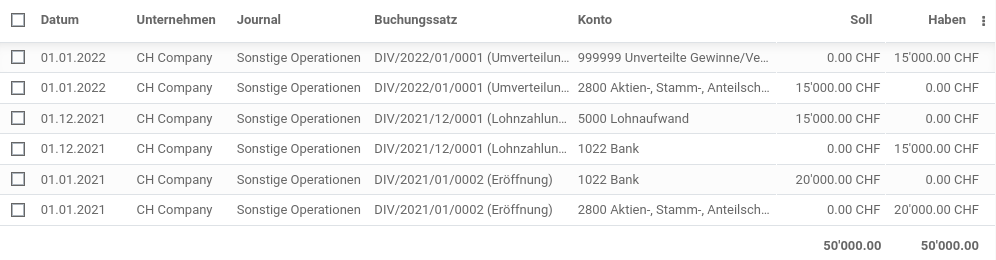

---
tags:
- Best-Practice
prev: ./best-practice
---
# Best Practice: Buchung Gewinn-/Verlustvortrag

In diesem Artikel wird anhand eines einfachen Beispiels erläutert wie man den Gewinn-/Verlustvortrag mit Odoo verbucht.

## Bilanz altes Jahr

Angeommen das Unternehmen hat im Jahr 2021 einen Verlust 15'000.00 CHF gemacht, wird dies auf der Erfolgsrechnung ausgewiesen.

Die Bilanz 2021 sieht dann wie folgt aus:

Der Jahresverlust wird aus der Erfolgsrechnung übertragen.

## Bilanz aktuelles Jahr

Nun muss der Gewinn-/Verlust ins Eigenkapital verbucht werden. Dies geschiet man einem Konto, welches diese Bendigungen erfüllt:

* **Code**: >= 9000 (Erscheint nicht in der Bilanz)
* **Kontentyp**: Jahresüberschuss/Jahresfehlbetrag

Dazu die Buchungen:

Und hier die Bilanz 2022:

Der Jahresverlust ist auf 0.00 CHF und das Eigenkapital angepasst.