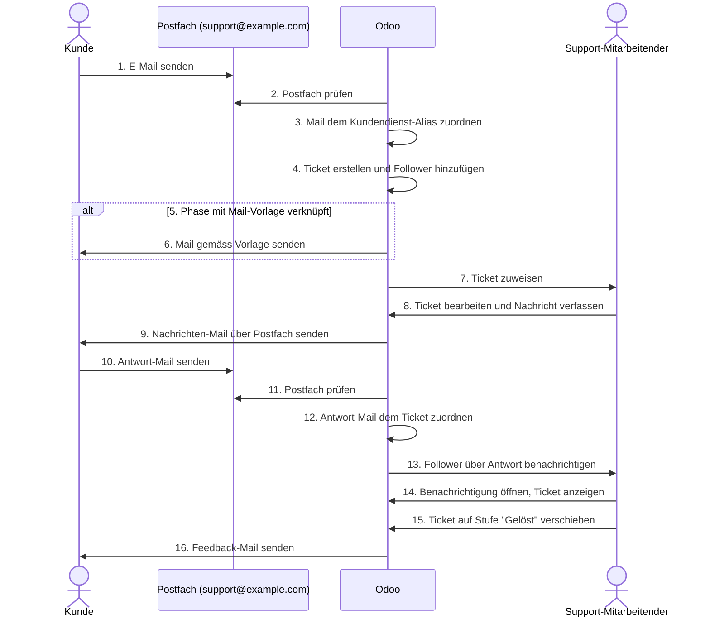

# Kommunkation im Kundendienst

Grundsätzlich kommuniziert man in der Kundendienst-App ähnlich wie es [Kommunikation mit Odoo](Best%20Practice%20Communication%20with%20Odoo.md) beschreibt. Jedoch gehen wir hier noch mehr ins Details.

## Voraussetzungen

Damit im Kundendienst aus E-Mails Tickets werden und die Kommunikation mit dem Kunden möglich ist, muss Odoo mit einem E-Mail-Postfach verbunden werden.

- [Ausgehender Mail-Server konfigurieren](Settings%20E-Mail.md#Ausgehender%20Mail-Server%20konfigurieren)
- [Ausgehender Mail-Server konfigurieren](Settings%20E-Mail.md#Ausgehender%20Mail-Server%20konfigurieren)

Dann muss auf dem Kundendienstteam ein Mail-Alias festgelegt werden.

- [E-Mail-Domain festlegen](Settings%20E-Mail.md#E-Mail-Domain%20festlegen)
- [Mail-Alias festlegen](Helpdesk.md#Mail-Alias%20festlegen)

Der Benutzer des Support-Mitarbeitenden muss Benachrichtigungen empfangen können.

- [Follower festlegen](Helpdesk.md#Follower%20festlegen)
- [Benachrichtigungs-Kanal festlegen](User.md#Benachrichtigungs-Kanal%20festlegen)

## Workflow

Im folgenden Worklfow nehmen wir an, dass Odoo unter der Adresse <support@example.com> E-Mails empfängt und daraus Tickets erstellen kann.

Der Workflow zeigt wie ein Ticket erstellt und gelöst wird:

1. Kunde schickt mail an support@example.com
2. Odoo prüft das Postfach
3. Odoo ordnet die Mail dem Kundendienst Mail-Alias zu
4. Odoo erstellt ein Ticket und fügt die Follower hinzu
5. Odoo prüft ob Phase mit einer Mail-Vorlage verknüpft ist
6. Odoo versendet eine Mail gemäss Vorlage
7. Ticket wird einem Support-Mitarbeitenden zugewiesen
8. Support-Mitarbeitender bearbeitet das Ticket und sendet eine Nachricht an den Kunden
9. Odoo versendet ein Nachrichten-Mail über das Postfach
10. Der Kunde empfängt und beantwortet die Nachrichten-Mail
11. Odoo prüft das Postfach
12. Odoo ordnet die Antwort-Mail dem Ticket zu
13. Odoo benachrichtigt die Follower über die Antwort
14. Der Support-Mitarbeitende erhält die Benachrichtigung und zeigt das Ticket an
15. Der Support-Mitarbeitende verschiebt das Ticket auf die Stufe "Gelöst"
16. Odoo versendet eine Feedback-Mail an den Kunden
