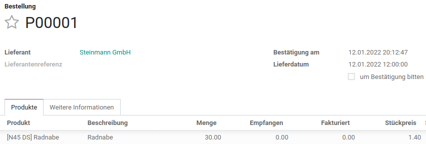
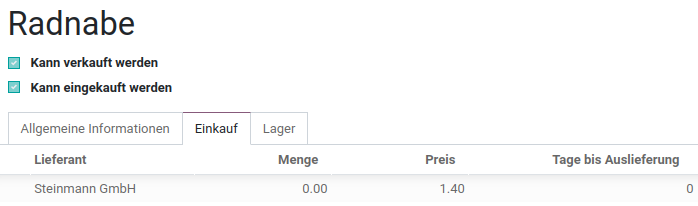
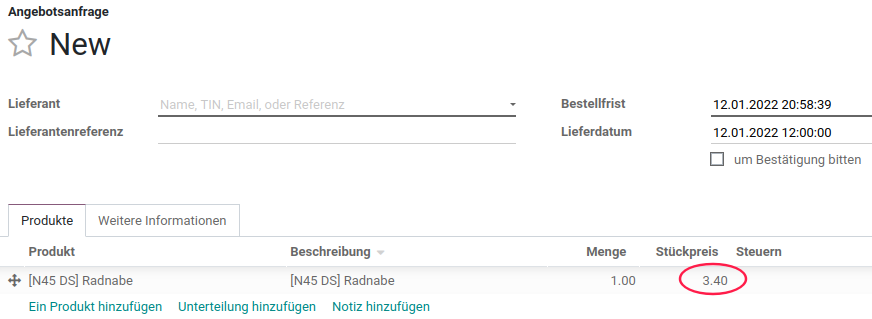
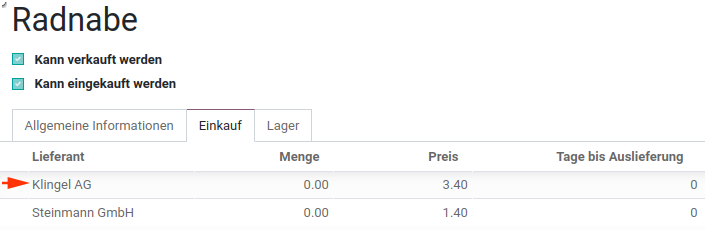
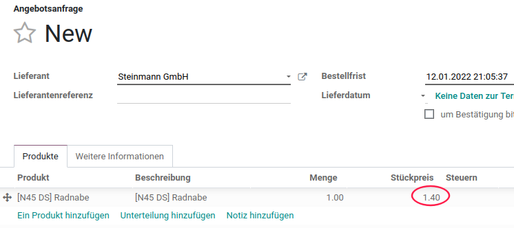
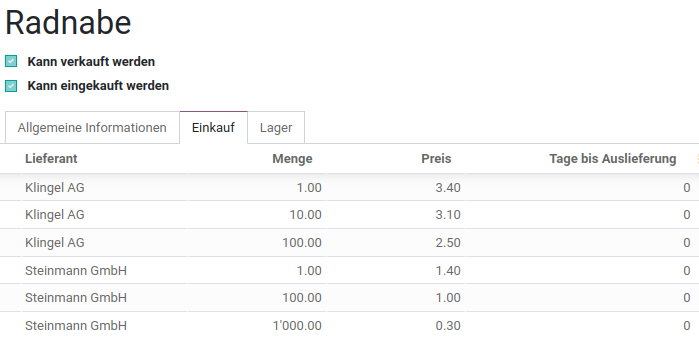
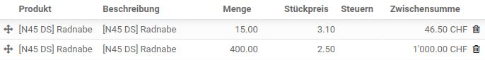

---
tags:
- Best-Practice
prev: ./best-practice
---

## Best-Practice Stückpreis definieren
Für die Definition des Stückpreises stehen verschiedene Funktionen zur Verfügung

## Fall 1: Neue Lieferantenbeziehung
Falls mit einem Beschaffungsauftrag zum ersten Mal bei einem bestimmten Lieferanten eingekauft wird, dann wird diese Lieferantenbeziehung beim Produkt im Abschnitt *Einkauf* eingetragen. Der Preis wird aus dem Beschaffungsauftrag übernommen und *Menge* und *Tage bis Auslieferung* auf 0 gesetzt.

::: warning
Weitere Bestellungen des selben Produkts beim selben Lieferanten haben keinen Einfluss auf die Listeneinträge im Abschnitt *Einkauf*
:::

## Fall 2: Mehrere Lieferanten stehen zur Wahl
Falls für eine neue Angebotsanfrage das Feld *Lieferant* noch nicht ausgefüllt ist, wird der Stückpreis des ersten Lieferanten der Produktinformationen in die Einkaufsliste übertragen.

Falls für die Angebotsanfrage ein Lieferant vorgegeben wird, dann erscheint in der Einkaufsliste der Stückpreis dieses Lieferanten.

## Fall 3: Preisstaffelung
Falls in den Produktionformationen eine Preisstaffelung in Abhängigkeit zu Lieferant und Menge abgebildet ist, wird in der Einkaufsliste der passende Preis eingetragen.

Beispiel Einkauf bei Liererant *Klingel AG*

Beispiel Einkauf bei Liererant *Steinmann GmbH*

