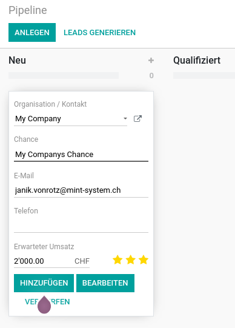

# Kundenverwaltung

{{ $frontmatter.description }}

Website: <https://www.odoo.com/de_DE/app/crm>

## Konfiguration

### Interessenten aus eingehenden E-Mails erstellen

Sie können für E-Mails, die an das Odoo-Postfach geschickt werden, Interessenten in der Kundenverwaltung generieren. Navigieren Sie nach *Kundenverwaltung > Konfiguration > Einstellungen* und aktivieren Sie die Option *Eingehende E-Mails*. Tragen Sie im neuen Feld den E-Mail-Alias des Odoo-Postfach ein.

## Interessenten

### Interessenten erstellen

Navigieren Sie nach *Kundenverwaltung > Interessenten* und erstellen Sie einen neuen Eintrag.

### Interessenten in Chance umwandeln

Wählen Sie einen Interessenten unter *Kundenverwaltung > Interessenten* aus und klicken Sie auf *In Chance Umwandeln*.

## Chancen

### Chance erstellen

Öffnen Sie die App *Kundenverwaltung* und klicken Sie auf *Neu*. Wählen Sie als erstes einen Kunden aus und geben Sie einen passenden Titel ein.

Speichern Sie die Chance in ihrer Pipeline mit *Hinzufügen*.

### Chance anreichern

Odoo kann zum Kunden Unternehmensdaten finden und der Chance hinzufügen. Wählen Sie eine Chance auf der Übersicht von *Kundenverwaltung* aus und klicken Sie auf *Aktionen > Anreichern*. Wenn Odoo Informationen zum Kunden findet, listet es diese auf der rechten Seite im Chatter auf.
