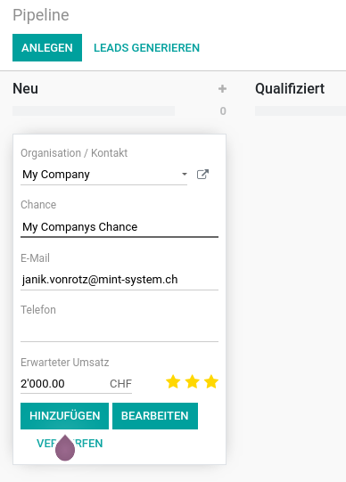

# CRM

{{ $frontmatter.description }}

Website: <https://www.odoo.com/de_DE/app/crm>

## Erweiterungen

| Erweiterung                                             | Beschreibung                            |
| ------------------------------------------------------- | --------------------------------------- |
| [CRM Lead Template](CRM%20Lead%20Template.md) | Lead Notizen von Vorlage aktualisieren. |
| [Sale CRM Note](Sale%20CRM%20Note.md)         | Notiz von Lead auf Angebot übertragen.  |

## Konfiguration

###  Interessenten aus eingehenden E-Mails erstellen

Gilt bis #Odoo15: 

Sie können für E-Mails, die an das Odoo-Postfach geschickt werden, Interessenten in der Kundenverwaltung generieren. Navigieren Sie nach _Kundenverwaltung > Konfiguration > Einstellungen_ und aktivieren Sie die Option _Eingehende E-Mails_. Tragen Sie im neuen Feld den E-Mail-Alias des Odoo-Postfach ein.

## Leads

### Leads erstellen

Navigieren Sie nach _Kundenverwaltung > Leads_ und erstellen Sie einen neuen Eintrag.

### Leads in Verkaufschance umwandeln

Wählen Sie einen Leads unter _CRM > Leads_ aus und klicken Sie auf _In Verkaufschance Umwandeln_.

## Verkaufschancen

### Verkaufschance erstellen

Öffnen Sie die App _CRM_ und klicken Sie auf _Neu_. Wählen Sie als erstes einen Kunden aus und geben Sie einen passenden Titel ein.

Speichern Sie die Verkaufschance in ihrer Pipeline mit _Hinzufügen_.

### Verkaufschance anreichern

Odoo kann zum Kunden Unternehmensdaten finden und der Verkaufschance hinzufügen. Wählen Sie eine Verkaufschance auf der Übersicht von _CRM_ aus und klicken Sie auf _Aktionen > Anreichern_. Wenn Odoo Informationen zum Kunden findet, listet es diese auf der rechten Seite im Chatter auf.

## Integration

### Outlook App einrichten

Odoo beitet ein App / AddIn für Outlook an. Bis Version 19.0 muss dieses als AddIn hinzugefügt werden. Ab Version 19.2 (SaaS) wird dieses als App hinzufügt.

**Odoo for Outlook**: Das ist die App. Dokumentation: https://www.odoo.com/documentation/saas-19.2/applications/general/integrations/mail_plugins/outlook.html

**Odoo Inbox AddIn**: Das ist das AddIn. Dokumentation: https://www.odoo.com/documentation/19.0/applications/general/integrations/mail_plugins/outlook.html

So sieht die Outlook App in Aktion aus:

