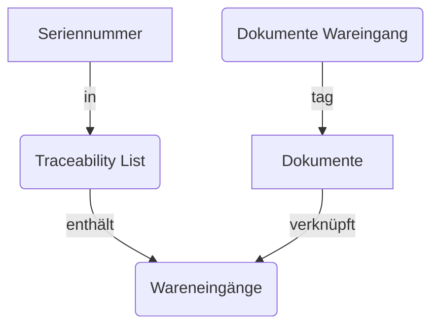

# Dokumente Aktionen


{{ $frontmatter.description }}

## Aktionen

### Dokumente aus Wareneingang taggen

Diese Serveraktion erfordert die Installation von [Stock Lot Traceability List](Stock%20Lot%20Traceability%20List.md) oder [Stock MRP Traceability List](Stock%20MRP%20Traceability%20List.md). Die Aktion führt diese Schritte aus:

- Für die ausgewählte Seriennummern die Traceability List anzeigen
- Alle Wareneingänge aus der Traceability List filtern
- Alle Dokument mit Verknüpfung auf einen gefilterten Wareneingang anzeigen
- Diese Dokumente mit "Dokumente aus Wareneingang" taggen



Navigieren Sie nach *Einstellungen > Technisch > Serveraktionen* und erstellen Sie einen neuen Eintrag:

Name der Aktion: `Dokumente aus Wareneingang taggen`\
Modell: `stock.lot` oder `mrp.production`\
Folgeaktion: `Python-Code ausführen`

Kopieren Sie die folgenden Zeilen in das Feld *Python-Code*:

```python
tag_name ='Dokumente aus Wareneingang'
document_tag = env['documents.tag'].search([('name', '=', tag_name)], limit=1)

# Remove tag from tagged documents
tagged_documents = env['documents.document'].search([('tag_ids', '=', document_tag.id)])
for tagged_document in tagged_documents:
      tagged_document.write({
      'tag_ids': tagged_document.tag_ids - document_tag
    })

for rec in records:
  
  # Get incoming picking ids
  traceability_lines = rec.traceability_line_ids
  incoming_lines = traceability_lines.filtered(lambda l: l.picking_id.picking_type_id.code == 'incoming' and l.product_id.tracking in ['serial', 'lot'])
  incoming_picking_ids = list(set(incoming_lines.mapped('picking_id.id')))
  
  # Search document linked to the picking ids
  documents = env['documents.document'].search([('res_model', '=', 'stock.picking'), ('res_id', 'in', incoming_picking_ids)])
  
  # Tag these documents
  for document in documents:
    document.write({
      'tag_ids': document.tag_ids + document_tag
    })
    
  message = 'Tagged %s documents with tag "%s".' % (len(documents), tag_name)

  action = {
    'type': 'ir.actions.client',
    'tag': 'display_notification',
    'params': {
      'message': message,
      'sticky': True
    }
  }
```

Die Aktion mit *Kontextuelle Aktion Erstellen* bestätigen.

## Geplante Aktionen

### Dokumente an Wareneingang zuordnen

Navigieren Sie nach *Einstellungen > Technisch > Geplante Aktionen* und erstellen Sie einen neuen Eintrag:

Name der Aktion: `Dokumente an Wareneingang zuordnen`\
Modell: `ir.actions.server`\
Ausführen alle: `1` Tage\
Nächstes Ausführungsdatum: `DD.MM.YYYY 06:00:00`\
Anzahl der Anrufe: `-1`\
Folgeaktion: `Python-Code ausführen`

Kopieren Sie die folgenden Zeilen in das Feld *Python Code*:

```python
tag = env['documents.tag'].search([ ('name','=','WE zugeordnet') ],limit=1)
folder = env['documents.folder'].search([ ('name','=','Wareneingang') ],limit=1)
documents = env['documents.document'].search([ ('folder_id','=',folder.id),('res_model','=','documents.document') ])
pickings = env['stock.picking'].search([ ('picking_type_code', '=', 'incoming'),('state','in',['done']) ])

messages = []
for document in documents:
  name = document.name.replace('_','/').replace('.pdf','')
  picking = pickings.filtered(lambda p: p.name == name)
  if picking:
    document.write({
      'res_model': 'stock.picking',
      'res_id': picking[0].id,
      'tag_ids': [tag.id]
    })
    messages.append('Assigned document %s to stock picking %s.' % (document.name, picking.name))

if messages:
  log(' '.join(messages))
```