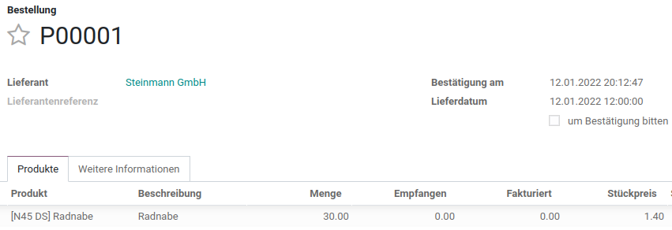
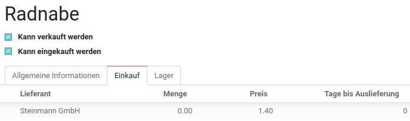
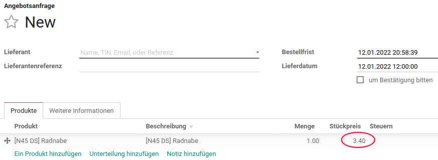
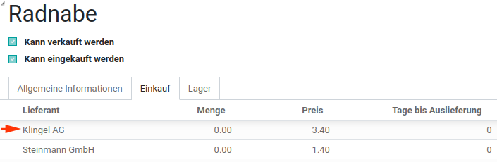

---
tags:
- HowTo
---
# Einkauf

Verbessern Sie die Leistung Ihrer Lieferkette und Ihres Bestands

| Erweiterung                                                                           | Beschreibung                                         |
| ------------------------------------------------------------------------------------- | ---------------------------------------------------- |
| [Einkauf Kaufverträge](Einkauf%20Kaufverträge.md)                                     | Kaufverträge für Rahmenbestellungen erstellen.       |
| [Purchase Order Line Date](Purchase%20Order%20Line%20Date.md)                         | Lieferdatum im Wareneingang automatisch nachtragen.  |
| [Purchase Partner Incoterm](Purchase%20Partner%20Incoterm.md)                         | Für jedem Partner die Incoterms festlegen.           |
| [Pruchase Order Line Position](Purchase%20Order%20Line%20Position.md)                 | Einkaufsaufträge mit Positionsnummern.               |
| [Purchase Order Line Price Default](Purchase%20Order%20Line%20Price%20Default.md)     | Standardpreis einer Einkaufsposition überschreiben.  |
| [Purchase order lines with discounts](Purchase%20order%20lines%20with%20discounts.md) | Rabatte auf Einkaufspositionen festlegen.            |
| [Purchase Order Validate](Purchase%20Order%20Validate.md)                             | Bestellung vor Versenden oder Bestätigen überprüfen. |

## Angebotsanfrage erstellen

Über *Anlegen* wird eine Angebotsanfrage eröffnet. Die Felder der Eingabemaske sind gemäss folgender Tabelle zu editieren:

| Bezeichnung         | Beschreibung                                                                                                                             |
| ------------------- | ---------------------------------------------------------------------------------------------------------------------------------------- |
| Lieferant           | Es erscheinen alle Einträge der Liste "Kontakte" zur Auswahl.                                                                            |
| Lieferantenreferenz | Referenz zur Bezeichnung seitens Lieferanten (ist zum Beispiel nützlich um beim Wareneingang einen Zusammenhang zu schaffen).            |
| Währung             | Die gemäss Optionen eingeschaltenen Währung erscheinen zur Auswahl.                                                                      |
| Order Deadline      | Der geplante Zeitpunkt, wann die Bestellung zum Auftrag werden soll.                                                                     |
| Lieferdatum         | Der erwartete Lieferzeitpunkt. Dieses Datum wird für die Prognosen verwedent.                                                            |
| Ask confirmation    | Wenn die Option eingeschaltet ist, erhält der Lieferant automatisch eine eMail-Erinnerung in der er den Lieferzeitpunkt bestätigen muss. |

Im Register Produkte werden die gewünschten Artikel gelistet.

## Stückpreis definieren
Für die Definition des Stückpreises stehen verschiedene Funktionen zur Verfügung

### Fall 1: Neue Lieferantenbeziehung
Falls mit einem Beschaffungsauftrag zum ersten Mal bei einem bestimmten Lieferanten eingekauft wird, dann wird diese Lieferantenbeziehung beim Produkt im Abschnitt *Einkauf* eingetragen. Der Preis wird aus dem Beschaffungsauftrag übernommen und *Menge* und *Tage bis Auslieferung* auf 0 gesetzt.

::: warning
Weitere Bestellungen des selben Produkts beim selben Lieferanten haben keinen Einfluss auf die Listeneinträge im Abschnitt *Einkauf*
:::

### Fall 2: Mehrere Lieferanten stehen zur Wahl
Falls für eine neue Angebotsanfrage das Feld *Lieferant* noch nicht ausgefüllt ist, wird der Stückpreis des ersten Lieferanten der Produktinformationen in die Einkaufsliste übertragen.

Falls für die Angebotsanfrage ein Lieferant vorgegeben wird, dann erscheint in der Einkaufsliste der Stückpreis dieses Lieferanten.

### Fall 3: Preisstaffelung
Falls in den Produktionformationen eine Preisstaffelung in Abhängigkeit zu Lieferant und Menge abgebildet ist, wird in der Einkaufsliste der passende Preis abgebildet.

Beispiel Einkauf bei Liererant *Klingel AG*

Beispiel Einkauf bei Liererant *Steinmann GmbH*

## Angebotsanfrage senden

Mit dem Knopf *Per E-Mail Versenden* wird eine PDF-Datei generiert und per eMail an den Lieferanten gesendet.

## Portal-Ansicht Bestellung anzeigen

Die Portal-Ansicht einer Bestellung können sie wie folgt anzeigen:
* Öffnen Angebotsanfrage
* Ausführen *Aktion > Teilen > Text kopieren*
* Neues privates Browser-Fenster öffnen
* Link in Adressleiste einfügen

::: tip
In einem privaten Browser werden die Cookies nicht geladen und somit wird man nicht automatisch bei Odoo angemeldet.
:::

## Portal Benutzerkonto anlegen
Falls sie für das Portal noch keinen Zugang haben, können sie über die Funktion *Benutzerkonto anlegen* ein Konto erstellen.

Benutzername und Passwort können gewählt werden.

## Lieferadresse ändern
Auf einer Bestellung ist die Lieferadresse standardmässig die Adresse der eigenen Firma gemäss *Einstellungen > Unternehmen*.
Falls eine andere Lieferadresse gewünscht ist, lässt sich das über das Einrichten eines entsprechendes Lagers/Vorgangstyp erreichen.

Jedes Lager hat eine Adresse.

Die Adresse kann auch eine spezielle Lieferandresse sein.

Falls also für eine Bestellung verschiedene Lieferadressen zur Verfügung stehen sollen,  muss für jede Adresse ein Lager eingerichtet werden.

Die Lieferanschrift kann auf der Bestellung gemäss der folgenden Abbildung gewählt werden (die Markierung zeigt den Vorgangstyp):

Die Bestellung sieht dann wie folgt aus:

