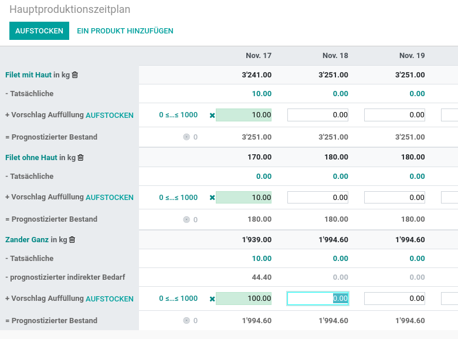

---
tags:
- HowTo
prev: ./
---
# Fertigung

Eine moderne Lösung für ein altes Problem.

Website: <https://www.odoo.com/de_DE/app/manufacturing>

## Bereiche

| Bereich                                           | Beschreibung                                   |
| ------------------------------------------------- | ---------------------------------------------- |
| [Fertigung Aktionen](Fertigung%20Aktionen.md)     | Fertigungs-Prozesse automatisieren.            |
| [Fertigung Stammdaten](Fertigung%20Stammdaten.md) | Produkte und Dienstleistungen zentral pflegen. |

## Erweiterungen

| Erweiterung                                                                                     | Beschreibung                                                                     |
| ----------------------------------------------------------------------------------------------- | -------------------------------------------------------------------------------- |
| [Cancel Manufacturing Order](Cancel%20Manufacturing%20Order.md)                                 | Fertigungsauftrag rückgängig machen.                                             |
| [MRP BoM Consumption](MRP%20BoM%20Consumption.md)                                               | Definieren Sie eine Stückliste, die bei der Lieferung verschrottet wird.         |
| [MRP BoM Position](MRP%20BoM%20Position.md)                                                     | Jede Komponente in der Stückliste erhält eine Positionsnummer.                   |
| [MRP Documents Share](MRP%20Documents%20Share.md)                                               | Teilen Sie Zeichnungen und Step-Dateien zu ihren Produkten als URL-Dokument.     |
| [MRP Production Assign Lot](MRP%20Production%20Assign%20Lot.md)                                 | Los aus eingehenden Lagerbuchungen an unreservierte Komponenten zuweisen.        |
| [MRP Production Create Upstream Backorder](MRP%20Production%20Create%20Upstream%20Backorder.md) | Erstelle Nachlieferungen für Pickings von Fertigungsaufträgen.                   |
| [MRP Production Release](MRP%20Production%20Release.md)                                         | Fertigungsaufträge können zurückgesetzt und freigegebenen werden.                |
| [MRP Production Unplan Move](MRP%20Production%20Unplan%20Move.md)                               | Zukünftiges Datum auf Lagerbuchung bei Planungsabruch festlegen.                 |
| [MRP Production Update Upstream Move](MRP%20Production%20Update%20Upstream%20Move.md)           | Aktualisiere offene Pickings von Fertigungsaufträgen bei Änderungen.             |
| [MRP Workorder Disable Autostart](MRP%20Workorder%20Disable%20Autostart.md)                     | Bei Aufruf von Arbeitsaufträgen in der Tablet-Ansicht nicht automatisch starten. |
| [MRP Workorder Set Producing Qty](MRP%20Workorder%20Set%20Producing%20Qty.md)                   | Arbeitsauftrag startet ohne erledigte Menge.                                     |
| [Manufacture Production Move Date](Manufacture%20Production%20Move%20Date.md)                   | Lieferdatum auf Fertigungsauftrag bearbeiten.                                    |
| [Product Barcode Generator](Product%20Barcode%20Generator.md)                                   | Autogenerate EAN13 product barcodes.                                             |
| [Product Country of Origin](Product%20Country%20of%20Origin.md)                                 | Bestimmen Sie für jedes Produkt ein Herkunftsland                                |
| [Product Feeder ID](Product%20Feeder%20ID.md)                                                   | Feeder-Textfeld auf dem Produkt.                                                 |
| [Product Name Sequence](Product%20Name%20Sequence.md)                                           | Generate product names based on a sequence.                                      |
| [Product Sequence](Product%20Sequence.md)                                                       | Produkreferenzen anhand einer Sequenz generieren lassen.                         |
| [Product State](Product%20State.md)                                                             | Lebenszyklus von Produkten festlegen.                                            |
| [Product Type Description](Product%20Type%20Description.md)                                     | Zu jedem Produkt ein Beschreibungsfeld.                                          |
| [Secondary Product Type Description](Secondary%20Product%20Type%20Description.md)               | Zu jedem Produkt ein zweites Beschreibungsfeld.                                  |

## Videos

| Video                                                                                    |
| ---------------------------------------------------------------------------------------- |
| [Odoo Experience 2021 - What's New in MRP?](https://www.youtube.com/watch?v=xTXc_FV9kKU) |

## BoM in Fertigungsauftrag neu laden

Mit dem Erstellen eines Fertigungsauftrags werden die Komponenten der Stückliste (BoM) als zu verwendendes Material übernommen. Falls die Stückliste zu einem späteren Zeitpunkt geändert wird, verändert sich der Fertigungsauftrag standardmässig nicht. Mit der folgend beschriebenen Funktion kann aber erreicht werden, dass der Fertigungsauftrag jederzeit mit der aktuellen Stückliste abgeglichen werden kann.

Die Server Aktion *Reload BoM* wird gemäss Beschreibung in [Aktion Fertigung Reload BoM erstellen](Fertigung%20Aktionen.md#Aktion%20Fertigung%20Reload%20BoM%20erstellen) erstellt. Anschliessend kann über den Menupunkt *Reload BoM* die BoM jederzeit neu geladen werden.

::: tip
Falls eine Stückliste leer ist (keine Komponenten) erscheint ein über MTO automatisch generierter Fertigungsauftrag im Status *Entwurf*. Falls die Stückliste Komponenten enthält, dann erscheint er im Status *Bestätigt*.
:::

## Hauptproduktionszeitplan anwenden

Öffnen Sie *Fertigung > Planung > Hauptproduktionszeitplan* und fügen Sie ein Produkt und ein Kompenenten-Produkt hinzu. Im Filter *Zeilen* wählen sie:

* Anfangslagerbestand
* Tatsächliche Nachfrage
* Prognostizierter indirekter Bedarf
* Aufzufüllen
* Prognostizierter Bestand

In der Zeile *Tatsächliche* sehen Sie die nachgefragte Menge. Geben Sie in der Zeile *Vorschlag Auffüllung* die zu produzierende Menge ein.

Für das Komponenten-Produkt wird nun der *prognostizierter indirekter Bedarf* berechnet. Erstellen Sie für dieses Produkt ebenfalls einen Vorschlag.

Wählen Sie für jedes Produkt *Aufstocken* um einen Auftrag gemäss hinterlegter Route zu erstellen.

## Mehrstufige Fertigung aktivieren

Aktivieren Sie die Option *Mehrstufige Routen* unter *Einstellungen > Lager > Lager*. Anschliessen Zeiten Sie das Standardlager unter *Lager > Konfiguration > Lager* an und aktivieren im Tab *Lager Konfiguraiton* die Option *Zusammenstellen der Komponenten und dann fertigen (2ter Schritt)*. Nun steht die Route für die mehrstufige Fertigung bereit.

::: tip
Damit die mehrstufige Fertigungs-Route direkt den Produkten zugewiesen werden kann, aktivieren Sie die Auswahlmöglichkeit auf der Route.

:::