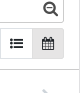

# HR Birthday Calender

{{ $frontmatter.description }}

Technischer Name: `hr_birthday_calendar`\
Repository: <https://github.com/Mint-System/Odoo-Apps-HR/tree/14.0/hr_birthday_calendar>

## Verwendung

### Geburtstagskalender anzeigen

Navigieren Sie nach *Personal > Mitarbeiterverzeichnis* und klicken Sie auf die Kalender-Ansicht. Nun erscheinen alle eingetragenen Geburtstage ohne Jahreszahl.

## Entwicklung

### Menü-Eintrag für Geburtstags-Kalender erstellen

Damit Sie einen direkten Zugriff auf den Geburtstags-Kalender erhalten, führen Sie [Neue Ansicht mit Aktion hinzufügen](Development%20Actions.md#Neue%20Ansicht%20mit%20Aktion%20hinzufügen) aus und verwenden diese Werte:

Name der Aktion: `Geburtstage`\
Objekt: `hr.employee.public`\
Ansichtsmodus: `calendar`\
Menü: `Geburtstage`\
Obermenü: `Personal`\
Aktion: `ir.actions.act_window` `Geburtstage`\
Nummernfolge: `100`

Das Ergebnis sollte so aussehen:

