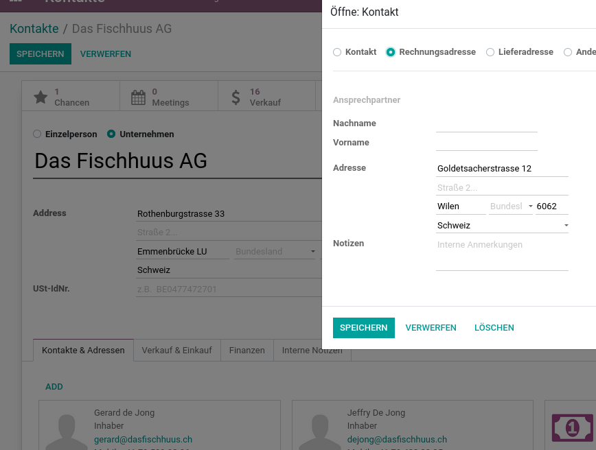

---
tags:
- HowTo
prev: ./
---
# Kontakte

Alle Kontaktdaten an einem Ort.

## Bereiche

| Bereich                                                   | Beschreibung                                   |
| --------------------------------------------------------- | ---------------------------------------------- |
| [Kontakte Datenmanagement](Kontakte%20Datenmanagement.md) | Daten zu Kontakte exportieren und importieren. |
| [[Kontakte Aktionen]]                                                          |                                                |

## Erweiterungen

| Erweiterung                                                                       | Beschreibung                                                   |
| --------------------------------------------------------------------------------- | -------------------------------------------------------------- |
| [Base Partner Sequence](Base%20Partner%20Sequence.md)                             | Sequenz auf Kundenreferenz.                                    |
| [Contact's birthdate](Contact%20Birthdate.md)                                     | Geburtstag bei Kontakten speichern für tolle Erinnerungen.     |
| [Partner Contact Department](OCA%20Partner%20Contact%20Department.md)             | Erweitert das Adressbuch mit Abteilungen.                      |
| [Partner Contact Department](Partner%20Contact%20Department%20Note.md)            | Abteilung auf Kontakten speichern.                             |
| [Partner Contact Location in Name](Partner%20Contact%20Location%20in%20Name.md)   | PLZ und Stadt in Kontaktauswahl anzeigen.                      |
| [Partner Duplicate Acc Number](Partner%20Duplicate%20Acc%20Number)                | Kontonummer für mehrere Bankkonten verwenden                   |
| [Partner Hide Address](Partner%20Hide%20Address.md)                               | Addressen auf Berichten ausblenden.                            |
| [Partner Ref Sequence](Partner%20Ref%20Sequence.md)                               | Automatische Vergabe der Kontakt-Referenz.                     |
| [Partner Secondary Email](Partner%20Secondary%20Email.md)                         | Zweite E-Mail für alle Kontakte.                               |
| [Partner Secondary Name](Partner%20Secondary%20Name.md)                           | Zweitname für Unternehmen.                                     |
| [Partner Type Order](Partner%20Type%20Order.md)                                   | Legen Sie einen Unternehmens-Kontakt als Bestelladresse fest.  |
| [Partner Type Sale](Partner%20Type%20Sale.md)                                     | Legen Sie einen Unternehmens-Kontakt als Verkaufsadresse fest. |
| [Partner first name and last name](Partner%20first%20name%20and%20last%20name.md) | Unterscheidet Vor- und Nachnamen.                              |

## Portal

### Portal-Zugriff gewähren

Wählen Sie einen Kontakt mit Mail-Adresse aus. Klicken Sie auf *Aktion > Grant portal access*. Im folgenden Dialog das Kächstchen *Portal* anklicken und bestätigen. Nun erhält der Benutzer eine Einladungs-Email, sofern der Benutzer eine gültige Mail-Adresse hinterlegt hat.

## Verwaltung

### Kontakte anlegen

Ein neuer Eintrag im Adressbuch können Sie über *Kontakte > Anliegen* erstellen.

Odoo verwendet Kontakte als zentrales Adressbuch. Verschiedene Apps wie Verkauf, CRM oder Finanzen greifen auf das Adressbuch zu.

### Details Felder

**Kopfdaten**

| Bezeichnung    | Beschreibung                                                                                       |
| ------------- | -------------------------------------------------------------------------------------------------- |
| Firmenadresse |                                                                                                    |
| Strasse       |                                                                                                    |
| Strasse 2     |                                                                                                    |
| Stadt         |                                                                                                    |
| Bundesland    | Wird für die Schweiz nicht verwendet                                                               |
| PLZ           |                                                                                                    |
| Land          | Muss immer einen Eintrag haben, weil für bestimmte Berechnungen die Information notwendig ist.     |
| Ust-IdNr.     | Unternehmens-Identifikationsnummer (UID). Mit dem Zusatz MWST ist sie gleichzeitig die MWST-Nummer |

**Kontakte & Adressen**

Individuen die als Einzelperson erfasst und einem Unternehmen zugeordnet sind erscheinen in diesem Abschnitt.

**Verkauf**

| Bezeichnung         | Beschreibung                                                                                                  |
| ------------------- | ------------------------------------------------------------------------------------------------------------- |
| Verkäufer           | Beim Erfassen eines neuen Angebots erscheint der hier zugeordnete Name aus der Benutzerliste.                 |
| Zahlungsbedingungen | Kundenspezifischer Standardwert für das Erstellen von Angeboten                                               |
| Preisliste          | Es können über die Zuordnung verschiedener Preislisten spezifische Verkaufspreise pro Kunde definiert werden. |

### Unterkontakte erfassen

Zeigen Sie ein Unternehmenskontakt via *Kontakte* an. Im Tab *Kontakte & Adressen* können Sie Unterkontakte erfassen. Diese Unterkontkakte werden als *Einzelpersonen* angelegt.

::: warning
Ändern Sie den Typ von Unterkontakten nicht auf Unternehmen. Wird beispielsweise die Rechnungsadresse als Kontakt vom Typ Unternehmen fesgelegt, erfolgt eine kommzerielle Trennung des Haupt- und Unterkonakt.
:::

### Bezeichnung Umsatzsteuer festlegen

Wenn keine Bezeichnung für die Umsatzsteuer festgelegt ist, verwendet Odoo *Tax ID*. Das ist beispielsweise im Footer eines Dokuments ersichtlich.

Wenn Sie die Bezeichnung ändern wollen, gehen Sie folgt vor. Öffnen Sie die Ansicht *Kontakte > Konfiguration > Lokalisierung > Länder* und wählen Sie ihr Land aus. Nun können Sie die Bezeichnung im Feld *USt.-Bezeichnung* festlegen.

### Gewerbliche Einheit festlegen

Auf jedem Odoo-Kontakt ist eine gewerbliche Einheit hinterlegt. Diese definiert über welchen Kontakt die Abrechnung erfolgen soll. Der Zugriff auf die gewerbliche Einheit erfordert, dass Sie das entsprechende [Snippet hinzufügen](Entwicklung%20Snippets.md#Snippet%20hinzufügen). Nur dann wird das Feld *Gewerbliche Einheit* auf der Formularansicht sichtbar:odoo manufacture to order

## Adressen

### Adressformat ändern

Standardmässig druckt Odoo die Adresse mit dem jeweiligen Land des Kontakts ab.

Damit das Land nicht abgedruckt wird, öffnen Sie die Ansicht *Kontakte > Konfiguration > Lokalisierung > Länder* und wählen ihr Land aus. Nun können Sie das *Layout in Berichten* festlegen.

### Rechnungsadresse in Anzeigenamen  einblenden

Damit die Bezeichnung *Rechnungsadresse* im Anzeigenamen der Kontakte eingelendet wird, muss der Kontakt als *Einzelperson* festgelegt werden und das Namensfeld muss leer gelassen werden.

In der Kontaktauswahl wird der Adresstyp so sichtbar:

## Einstellungen

### Partner Autovervollständigung deaktivieren

Wenn Sie nicht möchten, dass Odoo Kontaktdaten beim Erfassen vorschlägt und ihre Odoo Kontakt-Daten nicht hochgeladen werden, müssen Sie die *Partner Partner Autovervollständigung* unter *Einstellungen > Allgemeine Einstellungen > Kontakte* deaktivieren.

