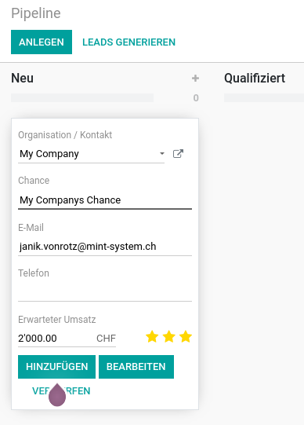

---
tags:
- HowTo
prev: ./
meta:
	- name: keywords
    content: crm leads customers
---
# Kundenveraltung

Verfolgen Sie Leads, schließen Sie Chancen ab und erhalten Sie genaue Prognosen.

## Chance erstellen

Öffnen Sie die App *Kundenverwaltung* und klicken Sie auf *Anlegen*. Wählen Sie als erstes einen Kunden aus und geben Sie einen passenden Titel ein.

Speichern Sie die Chance in ihrer Pipeline mit *Hinzufügen*.