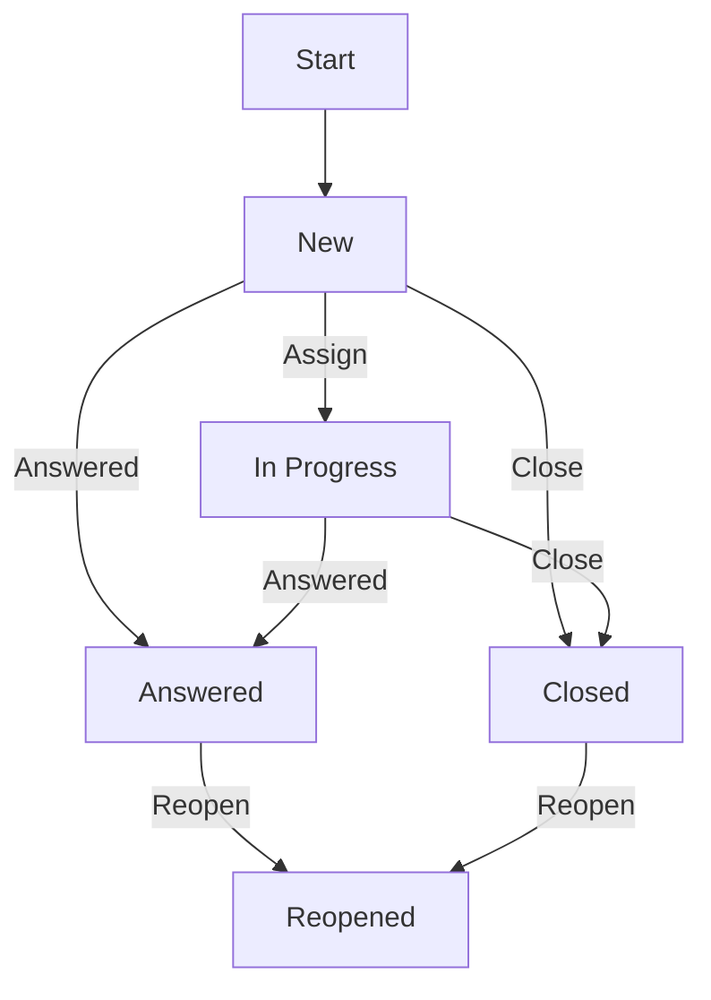

# Legal Advice Base

{{ $frontmatter.description }}

Technischer Name: `legal_advice_base`\
Repository: <https://github.com/Sozialinfo/Odoo-Apps-Sozialinfo/tree/16.0/legal_advice_base>

## Beschreibung

