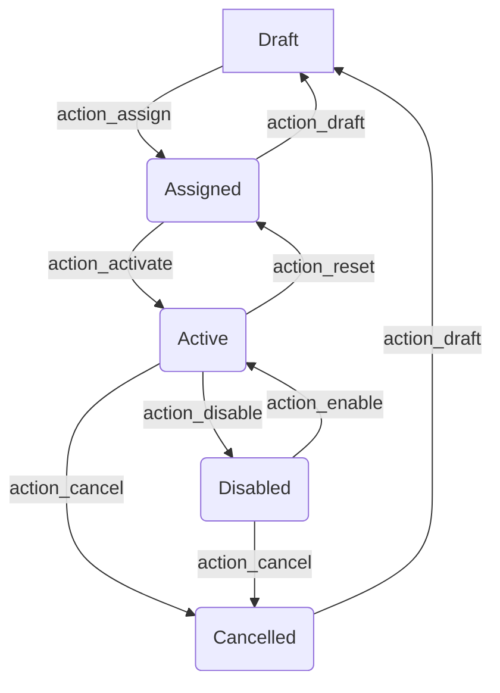

# Lizenz


{{ $frontmatter.description }}

Technischer Name: `license`\
Repository: <https://github.com/Mint-System/Odoo-Apps-Vertical-SaaS/tree/16.0/license>

## Erweiterungen

| Erweiterung                                         | Beschreibung                                                    |
| --------------------------------------------------- | --------------------------------------------------------------- |
| [License OCAD](License%20OCAD.md)                   | Synchronisation Lizenzen mit dem OCAD Lizenzaktivierungsdienst. |
| [License Sale](License%20Sale.md)                   | Lizenz aus Verkaufsauftrag generieren.                          |
| [License Subscription](License%20Subscription.md)   | Lizenzen mit Abonnementen erneuern.                             |
| [License Website Sale](License%20Website%20Sale.md) | Im Webshop gekaufte Lizenzen aktivieren.                        |
| [License Website](License%20Website.md)             | Kundenportal zur Lizenzverwaltung.                              |
| [[License Partner Comission]]                       |                                                                 |

## Beschreibung



## Konfiguration

### Lizenztyp erfassen

Navigieren Sie nach _Lizenz > Konfigurationen > Lizenztyp_ und erstellen Sie einen neuen Eintrag. Den _Lizenztyp_ können Sie Lizenzen und Lizenzprodukten zuordnen.

## Verwendung

### Lizenz erstellen

Zeigen Sie _Lizenzen_ an und erstellen Sie einen neuen Eintrag. Wählen Sie einen _Partner_ aus und speichern Sie den neuen Eintrag. Es wird ein Lizenzname und ein Schlüssel generiert.

::: tip
Sie können auch einen benutzerdefinierten Lizenznamen und Schlüssel vergeben.
:::

## Aktionen

### Lizenz abbrechen

Navigieren Sie nach _Einstellungen > Technisch > Server-Aktionen_ und erstellen Sie einen neuen Eintrag:

Name der Aktion: `Lizenz abbrechen`\
Modell: `license.license`\
Folgeaktion: `Python-Code ausführen`

Kopieren Sie die folgenden Zeilen in das Feld _Python Code_:

```python
for rec in records:
  rec.action_cancel()
```

Die Aktion mit dem Knopf _Kontextuelle Aktion erstellen_ bestätigen und dann speichern.

In der Liste der Lizenzen können Sie die Einträge markieren und _Aktionen > Lizenz abbrechen_ auswählen.

### Lizenz aktivieren

Navigieren Sie nach _Einstellungen > Technisch > Server-Aktionen_ und erstellen Sie einen neuen Eintrag:

Name der Aktion: `Lizenz aktivieren`\
Modell: `license.license`\
Folgeaktion: `Python-Code ausführen`

Kopieren Sie die folgenden Zeilen in das Feld _Python Code_:

```python
for rec in records:
  rec.action_activate()
```

Die Aktion mit dem Knopf _Kontextuelle Aktion erstellen_ bestätigen und dann speichern.

In der Liste der Lizenzen können Sie die Einträge markieren und _Aktionen > Lizenz aktivieren_ auswählen.
