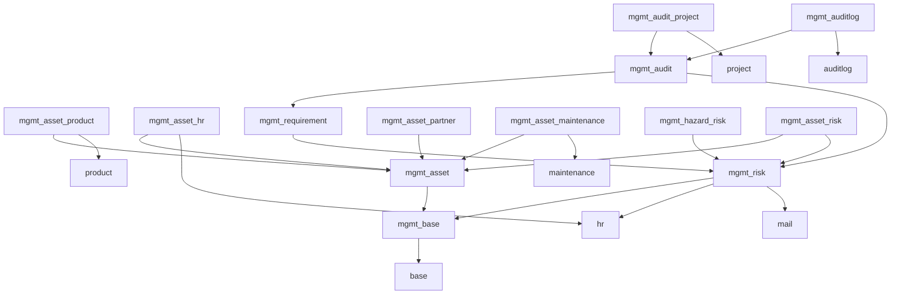

# Management System

{{ $frontmatter.description }}

## Erweiterungen

| Erweiterung                                             | Beschreibung                                                       |
| ------------------------------------------------------- | ------------------------------------------------------------------ |
| [Mgmt Asset HR](Mgmt%20Asset%20HR.md)                   | sset-Owner für Mitarbeitende festlegen.                            |
| [Mgmt Asset Maintenance](Mgmt%20Asset%20Maintenance.md) | Asset-Owner für Ausrüstungen und Kategorien festlegen.             |
| [Mgmt Asset Partner](Mgmt%20Asset%20Partner.md)         | Asset-Owner für Kontakte festlegen.                                |
| [Mgmt Asset Product](Mgmt%20Asset%20Product.md)         | Asset-Owner auf Produkte festlegen.                                |
| [Mgmt Asset Risk](Mgmt%20Asset%20Risk.md)               | Verbinde Risiken und Assets.                                       |
| [Mgmt Audit Project](Mgmt%20Audit%20Project.md)         | Erstellen Sie Projektaufgaben für Empfehlungen und Nonconformties. |
| [Mgmt Audit](Mgmt%20Audit.md)                           | Auditieren Sie ihr Unternehmen.                                    |
| [Mgmt Auditlog](Mgmt%20Auditlog.md)                     | Log-Regeln für OCA Auditlog.                                       |
| [Mgmt Base](Mgmt%20Base.md)                             | Basis für die Management-System Module.                            |
| [Mgmt Hazard Risk](Mgmt%20Hazard%20Risk.md)             | Risiko-Kalkulation basieren auf Gefahren.                          |
| [Mgmt Requirement](Mgmt%20Requirement.md)               | Verwalten Sie Anforderungen and die Organisation.                  |
| [Mgmt Risk](Mgmt%20Risk.md)                             | Verwaltung von ISO27001 Risiken.                                   |
| [Mmgt Asset](Mmgt%20Asset.md)                           | Asset-Verwaltung für das Management-System.                        |

## Beschreibung

Das Mint System Mangemen-System besteht aus mehreren Modulen. Die folgende Grafik zeigt die Abhängigkeit dieser Module:

