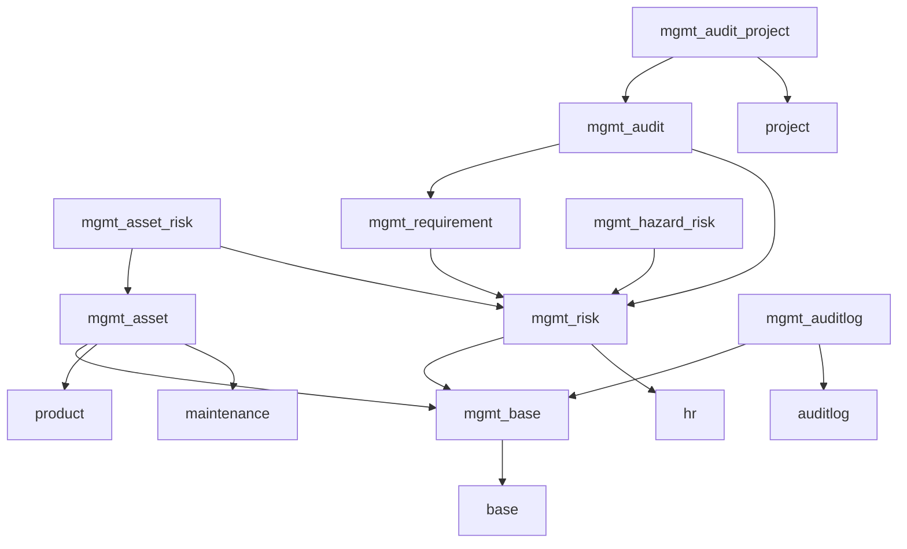

# Management Systems

{{ $frontmatter.description }}

## Erweiterungen

| Erweiterung                                     | Beschreibung                                                       |
| ----------------------------------------------- | ------------------------------------------------------------------ |
| [Management System](Mgmtsystem.md)              | Management System by OCA.                                          |
| [Management](mgmt.md)                           | Management System by Mint System.                                  |
| [Mgmt Asset Risk](Mgmt%20Asset%20Risk.md)       | Verbinde Risiken und Assets.                                       |
| [Mgmt Audit Project](Mgmt%20Audit%20Project.md) | Erstellen Sie Projektaufgaben für Empfehlungen und Nonconformties. |
| [Mgmt Audit](Mgmt%20Audit.md)                   | Auditieren Sie ihr Unternehmen.                                    |
| [Mgmt Base](Mgmt%20Base.md)                     | Basis für die Management-System Module.                            |
| [Mgmt Hazard Risk](Mgmt%20Hazard%20Risk.md)     | Risiko-Kalkulation basieren auf Gefahren.                          |
| [Mgmt Requirement](Mgmt%20Requirement.md)       | Verwalten Sie Anforderungen and die Organisation.                  |
| [Mgmt Risk](Mgmt%20Risk.md)                     | Verwaltung von ISO27001 Risiken.                                   |
| [Mgmtsystem Audit](Mgmtsystem%20Audit.md)       | Audit-Module for the OCA Management System.                            |
| [Mmgt Asset](Mmgt%20Asset.md)                   | Asset-Verwaltung für das Management-System.                        |

## Beschreibung

Das Mint System Mangement System besteht aus verschiedenen Modulen. Die folgende Grafik zeigt die Abhängigkeit der Module:

