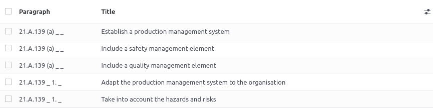
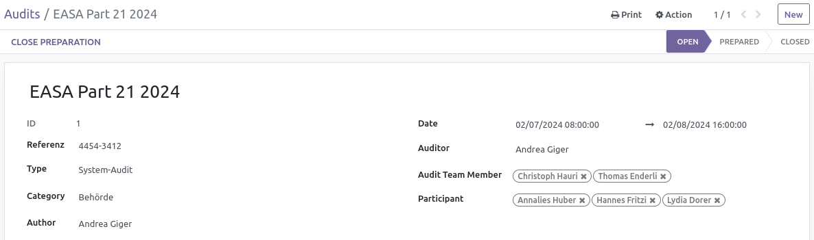
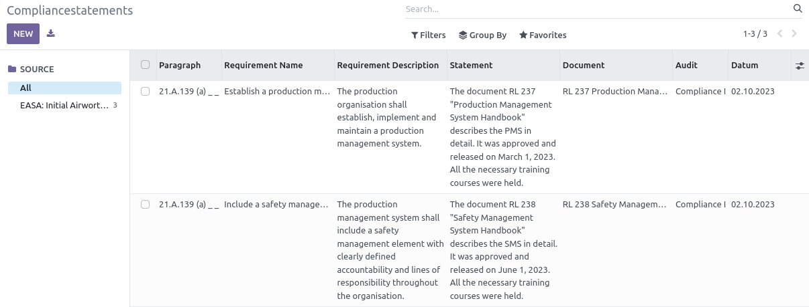

# Management (Requirements, Compliance, Audits)

{{ $frontmatter.description }}

Technischer Name: `mgmt`\
Repository: <https://github.com/Mint-System/Odoo-Apps-Management/tree/16.0/mgmt>

## Description

## Paragraphs

## Requirements

## Audits

### Master data

Define who carries out which audit and when. What the content is, how the audit team is composed and who is involved.

### Preparation

The document list defines the scope.

Close the preparation with the "Close Preparation" button.

The audit program created in this way can be sent out as an invitation.

## Compliancestatements

