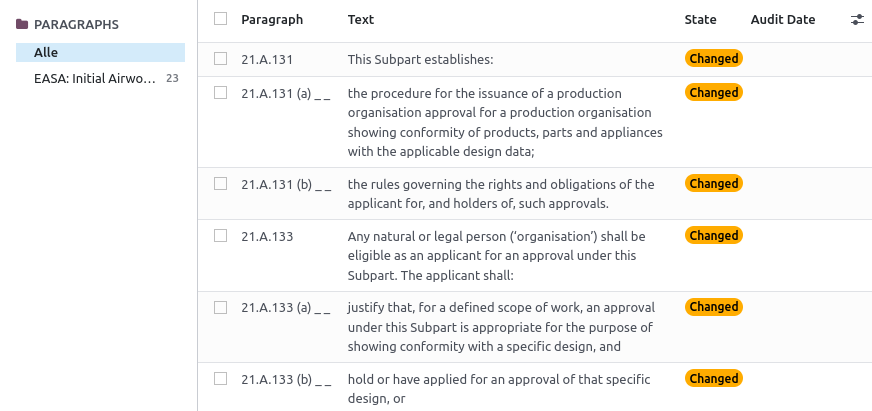

# Management (Requirements, Compliance, Audits)

{{ $frontmatter.description }}

Technischer Name: `mgmt`\
Repository: <https://github.com/Mint-System/Odoo-Apps-Management/tree/16.0/mgmt>

## Paragraphs

## Requirements

## Audits

### Stammdaten

### Vorbereitung

## Compliance Statements

