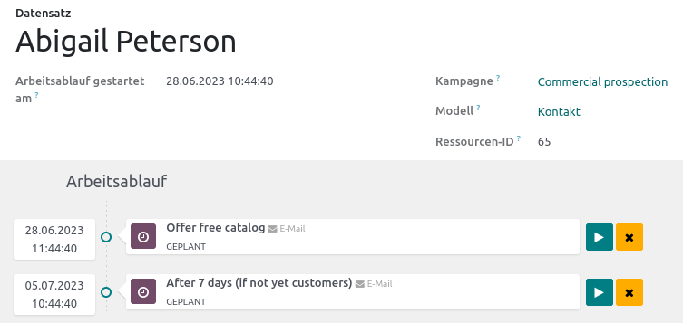

# Marketing-Automatisierung

{{ $frontmatter.description }}

Website: <https://www.odoo.com/de_DE/app/marketing-automation>

## Verwendung

### Kampagne anlegen

Navigieren Sie nach *Marketing-Automatisierung > Kampagnen* und wählen Sie *Neu*. Vergeben Sie einen passenden Namen und wählen Sie als *Ziel* den Wert *Kontakt*. 

### Marketing-Aktivität erstellen

Navigieren Sie nach *Marketing-Automatisierung > Kampagnen* und rufen Sie eine Kampagne auf. Wählen Sie die Aktion *Eine neue Aktivität hinzufügen*. Dazu die wichtigsten Felder:

* **Name Aktivität**: Vergeben
* **Aktivitätstyp**: Mit der Option *E-Mail* wird anhand einer E-Mail-Vorlage eine E-Mail verschickt. Mit der Option *Serveraktion*, wird die ausgewählte Serveraktion ausgeführt. 
* **Auslöser**: Konfigurieren Sie den Auslöser der Aktivität. 
* **Tätigkeitsfilter**: Schränken Sie die Auswahl der Ziele ein. 

Dazu ein Beispiel:

### Untergeordnete Marketing-Aktivität erstellen

Abhängig von den Resultaten einer Aktivität, kann eine Unteraktivität erstellt werden. Zeigen Sie via *Markting-Automatisierung > Kampagnen* die Aktivität an und wählen Sie den Bereich *Untergeordnete Aktivität hinzufügen* an.

Klicken Sie auf einen Auslöser in der Auswahl. Der Dialog zur Erstellung einer Markting-Aktivität wird geöffnet und der Auslöser vorkonfiguriert.

### Marketing-Aktivität testen

Navigieren Sie nach *Marketing-Automatisierung > Kampagnen* und zeigen Sie eine Kampagne an. Wählen Sie die Aktion *Einen Test Starten*. Wählen Sie einen bestimmten Kontakt aus und bestätigen Sie den Dialog mit *Weiter*. Im neuen Dialog können Sie nun ausgewählte Marketing-Aktivitäten starten.

::: tip
Auf der Kampange finden Sie einen Smart-Link *X Tests*, der Sie zu den erstellten Tests bringt.
:::

### Kampagne starten

Navigieren Sie nach *Marketing-Automatisierung > Kampagnen* und zeigen Sie eine Kampagne an. Wählen Sie die Aktion *Starten*.

### Teilnehmer generieren und Aktivität ausführen

Navigieren Sie nach *Marketing-Automatisierung > Kampagnen* und zeigen Sie eine laufende Kampagne an. Wählen Sie die Aktion *Teilnehmer Generieren*. Bestätigen Sie den Dialog und wählen Sie anschliessend *Aktivitäten ausführen*. Bestätigen Sie auch diesen Dialog. Die Marketing-Aktivitäten werden nun gemäss Auslöser geplant und vom Scheduler ausgeführt.

### Kampagnen-Teilnehmer anzeigen

Navigieren Sie nach *Marketing-Automatisierung > Kampagnen* und zeigen Sie eine laufende Kampagne an. Wählen Sie den Smart-Link *X Teilnehmer* und zeigen Sie einen Eintrag an.

::: tip
Für Teilnehmer im Status *Vollständig* wurden alle Marketing-Aktivitäten absolviert. 
:::