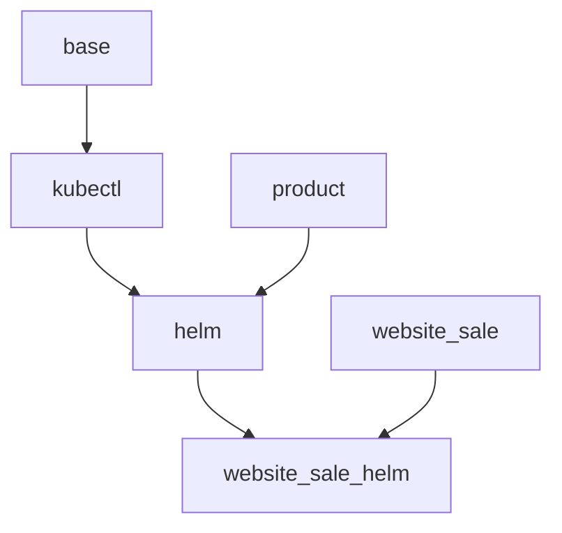

# Mint Cloud

{{ $frontmatter.description }}

Website: <https://wiki.mint-system.ch/odoo-hosting-mint-cloud.html>

## Erweiterungen

| Erweiterung                                   | Beschreibung                          |
| --------------------------------------------- | ------------------------------------- |
| [Helm](Helm.md)                               | Helm-Repos und Charts deployen.       |
| [kubectl](kubectl)                            | Kubernetes-Konfigurationen verwalten. |
| [Website Sale Helm](Website%20Sale%20Helm.md) | Services über Webshop verkaufen.      |

## Beschreibung

Die Mint Cloud ist ein Kundenportal zur Verwaltung von Kubernetes-Deployments. Das Portal besteht aus mehreren Odoo-Modulen. Die folgende Grafik zeigt die Abhängigkeit dieser Module:

