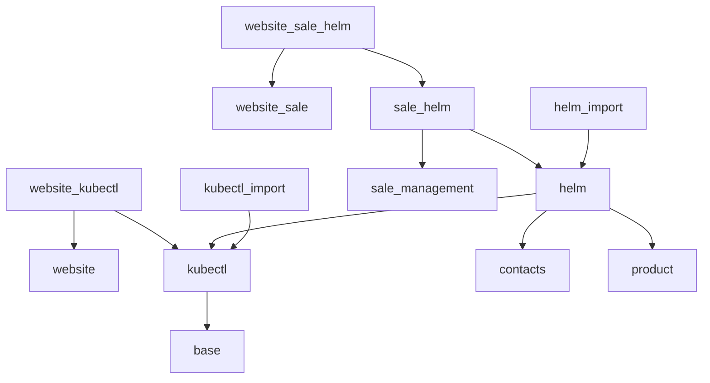

# Mint Cloud

{{ $frontmatter.description }}

Website: <https://wiki.mint-system.ch/odoo-hosting-mint-cloud.html>

## Erweiterungen

| Erweiterung                                   | Beschreibung                                 |
| --------------------------------------------- | -------------------------------------------- |
| [Helm Import](Helm%20Import.md)               | Daten aus Helm Repo importieren.             |
| [Helm Portal](Helm%20Portal.md)               | Helm Release in Portal verwalten.            |
| [Helm](Helm.md)                               | Helm-Repos und Charts deployen.              |
| [Kubectl Contacts](Kubectl%20Contacts.md)     | Consulting Partner in Kontakte verwalten.    |
| [Kubectl Import](Kubectl%20Import.md)         | Daten aus Kubernetes Cluster importieren.    |
| [Sale Helm](Sale%20Helm.md)                   | Bei Verkauf ein Helm-Release installieren.   |
| [Website Kubectl](Website%20Kubectl.md)       | Kubernetes Cluster auf Website präsentieren. |
| [Website Sale Helm](Website%20Sale%20Helm.md) | Services über Webshop verkaufen.             |
| [kubectl](kubectl)                            | Kubernetes-Konfigurationen verwalten.        |

## Beschreibung

Die Mint Cloud ist ein Kundenportal zur Verwaltung von Kubernetes-Deployments. Das Portal besteht aus mehreren Odoo-Modulen. Die folgende Grafik zeigt die Abhängigkeit dieser Module:

```mermaid
graph TD
    website_kubectl --> website
    website_kubectl --> kubectl
    kubectl --> base
    website_sale_helm --> website_sale
    website_sale_helm --> sale_helm
    sale_helm --> helm
    sale_helm --> sale_management
    helm_import --> helm
    helm --> contacts
    helm --> product
    helm --> kubectl
    kubectl_import --> kubectl
```
