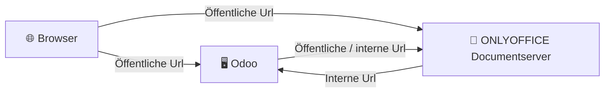

# ONLYOFFICE Odoo

{{ $frontmatter.description }}

Technischer Name: {{ $frontmatter.name }}\
Repository: <a v-bind:href="`https://${$frontmatter.forge}/${$frontmatter.repo}/tree/${$frontmatter.versions[0]}/${$frontmatter.name}`">https://{{ $frontmatter.forge }}/{{ $frontmatter.repo }}/tree/{{ $frontmatter.versions[0] }}/{{ $frontmatter.name }}</a>

## Beschreibung

Mit diesem Modul können Dokumente aus Odoo via dem ONLYOFFICE Dokumentserver bearbeitet werden. Damit das Zusammenspiel funktioniert müssen die korrekte Urls hinterlegt werden.

## Konfiguration

### Verbindung zu ONLYOFFICE Dokumentserver herstellen

Zeigen Sie _Einstellungen > ONLYOFFICE_ an. Im Bereich _Allgemeine Einstellungen_ konfigieren Sie diese Angaben:

- **ONLYOFFICE Docs-Adresse**: Öffnentliche Url des Dokumentserver.
- **Zertifikatsüberprüfung deaktivieren**: Wenn HTTPS-Zertifikate selbst signiert sind, kann diese Option aktiviert werden.
- **ONLYOFFICE Docs Geheimschlüssel**: JWT-Geheimnis hier eitnragen.
- **ONLYOFFICE Docs-Adresse für interne Anfragen vom Server**: Öffentliche oder interne erreichbare Url für Kommunikation von Odoo nach Dokumentserver eintragen.
- **Serveradresse für interne Anfragen von ONLYOFFICE Docs**: Öffentliche oder interne erreichbare Url für Kommunikation von Dokumentserver nach Odoo eintragen.
- 