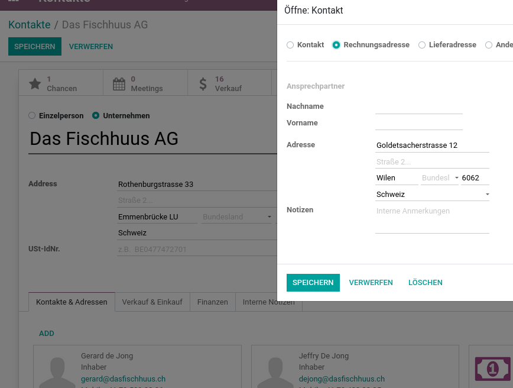

# Kontakte

{{ $frontmatter.description }}

## Bereiche

| Bereich                                                    | Beschreibung                                   |
| ---------------------------------------------------------- | ---------------------------------------------- |
| [Kontakte Aktionen](Partner%20Actions.md)                  | Arbeitsflüsse mit Kontakte automatisieren.     |
| [Kontakte Datenmanagement](Partner%20Data%20Management.md) | Daten zu Kontakte exportieren und importieren. |

## Erweiterungen

| Erweiterung                                                                                       | Beschreibung                                                      |
| ------------------------------------------------------------------------------------------------- | ----------------------------------------------------------------- |
| [Base Country Sequence](Base%20Country%20Sequence.md)                                             | Länder-Liste manuell sortieren.                                   |
| [Base Partner Sequence](Base%20Partner%20Sequence.md)                                             | Sequenz auf Kundenreferenz.                                       |
| [Contact Birthdate](Contact%20Birthdate.md)                                                       | Geburtstag bei Kontakten speichern für tolle Erinnerungen.        |
| [Partner Bank Code](Partner%20Bank%20Code.md)                                                     | Eindeutige Nummer auf Bank festlegen.                             |
| [Partner Color Codes](Partner%20Color%20Codes.md)                                                 | Kontakte mit Farben und Stichwörter markieren.                    |
| [Partner Contact Birthdate](Partner%20Contact%20Birthdate.md)                                     | Feld Geburtstag und Alter auf Kontakt vom Typ Einzelperson.       |
| [Partner Contact Department Note](Partner%20Contact%20Department%20Note.md)                       | Abteilung auf Kontakten speichern.                                |
| [Partner Contact Department](OCA%20Partner%20Contact%20Department.md)                             | Erweitert das Adressbuch mit Abteilungen.                         |
| [Partner Contact Location in Name](Partner%20Contact%20Location%20in%20Name.md)                   | PLZ und Stadt in Kontaktauswahl anzeigen.                         |
| [Partner Contact Personal Information Page](Partner%20Contact%20Personal%20Information%20Page.md) | Tab in Kontakt-Formular für persönliche Informationen.            |
| [Partner Duplicate Acc Number](Partner%20Duplicate%20Acc%20Number)                                | Kontonummer für mehrere Bankkonten verwenden                      |
| [Partner Firstname](Partner%20Firstname.md)                                                       | Unterscheidet Vor- und Nachnamen.                                 |
| [Partner Hide Address](Partner%20Hide%20Address.md)                                               | Addressen auf Berichten ausblenden.                               |
| [Partner Multi Pricelist](Partner%20Multi%20Pricelist.md)                                         | Mehrere Preislisten mit Start- und Enddatum auf Kunden festlegen. |
| [Partner Multiline Street2](Partner%20Multiline%20Street2.md)                                     | Mehrzeiliger Text in zweiter Strasse hinzufügen.                  |
| [Partner Ref Sequence](Partner%20Ref%20Sequence.md)                                               | Automatische Vergabe der Kontakt-Referenz.                        |
| [Partner Secondary Email](Partner%20Secondary%20Email.md)                                         | Zweite E-Mail für alle Kontakte.                                  |
| [Partner Secondary Name](Partner%20Secondary%20Name.md)                                           | Zweitname für Unternehmen.                                        |
| [Partner Type Order](Partner%20Type%20Order.md)                                                   | Legen Sie einen Unternehmens-Kontakt als Bestelladresse fest.     |
| [Partner Type Sale](Partner%20Type%20Sale.md)                                                     | Legen Sie einen Unternehmens-Kontakt als Verkaufsadresse fest.    |

## Portal

### Portal-Zugriff gewähren

Wählen Sie einen Kontakt mit Mail-Adresse aus. Klicken Sie auf *Aktion > Grant portal access*. Im folgenden Dialog das Kächstchen *Portal* anklicken und bestätigen. Nun erhält der Benutzer eine Einladungs-Email, sofern der Benutzer eine gültige Mail-Adresse hinterlegt hat.

## Verwendung

### Kontakt-Stichwörter anlegen

Navigieren Sie nach *Kontakte > Konfiguration > Kontakt Tag*. Hier können Sie Stichwörter verwalten, die auf dem Kontaktformular ausgewählt werden können.

### Kontakte anlegen

Ein neuer Eintrag im Adressbuch können Sie über *Kontakte > Anliegen* erstellen.

Odoo verwendet Kontakte als zentrales Adressbuch. Verschiedene Apps wie Verkauf, CRM oder Finanzen greifen auf das Adressbuch zu. Eine Aufstellung der wichtigsten Felder:

| Bezeichnung    | Beschreibung                                                                                       |
| ------------- | -------------------------------------------------------------------------------------------------- |
| Strasse       |                                                                                                    |
| Strasse 2     |                                                                                                    |
| Stadt         |                                                                                                    |
| Bundesland    | Wird für die Schweiz nicht verwendet                                                               |
| PLZ           |                                                                                                    |
| Land          | Muss immer einen Eintrag haben, weil für bestimmte Berechnungen die Information notwendig ist.     |
| Ust-IdNr.     | Unternehmens-Identifikationsnummer (UID). Mit dem Zusatz MWST ist sie gleichzeitig die MWST-Nummer |

Tab *Verkauf & Einkauf*.

| Bezeichnung         | Beschreibung                                                                                                  |
| ------------------- | ------------------------------------------------------------------------------------------------------------- |
| Verkäufer           | Beim Erfassen eines neuen Angebots erscheint der hier zugeordnete Name aus der Benutzerliste.                 |
| Zahlungsbedingungen | Kundenspezifischer Standardwert für das Erstellen von Angeboten                                               |
| Preisliste          | Es können über die Zuordnung verschiedener Preislisten spezifische Verkaufspreise pro Kunde definiert werden. |

### Unterkontakte erfassen

Zeigen Sie ein Unternehmenskontakt via *Kontakte* an. Im Tab *Kontakte & Adressen* können Sie Unterkontakte erfassen. Diese Unterkontkakte werden als *Einzelpersonen* angelegt.

::: warning
Ändern Sie den Typ von Unterkontakten nicht auf Unternehmen. Wird beispielsweise die Rechnungsadresse als Kontakt vom Typ Unternehmen festgelegt, erfolgt eine kommerzielle Trennung des Haupt- und Unterkonakt.
:::

### Kontakte anhand Stichwort filtern

Navigieren Sie nach *Kontakte* und geben Sie das Stichwort im Feld *Suche* ein. Drücken Sie noch nicht <kbd>Enter</kbd>, sondern navigieren mit Pfeiltasten zur Auswahl *Suchen Stichwörter für:* und drücken Sie dann <kbd>Enter</kbd>.

### Bezeichnung Umsatzsteuer festlegen

Wenn keine Bezeichnung für die Umsatzsteuer festgelegt ist, verwendet Odoo *Tax ID*. Das ist beispielsweise im Footer eines Dokuments ersichtlich.

Wenn Sie die Bezeichnung ändern wollen, gehen Sie folgt vor. Öffnen Sie die Ansicht *Kontakte > Konfiguration > Lokalisierung > Länder* und wählen Sie ihr Land aus. Nun können Sie die Bezeichnung im Feld *USt.-Bezeichnung* festlegen.

### Gewerbliche Einheit festlegen

Auf jedem Odoo-Kontakt ist eine gewerbliche Einheit hinterlegt. Diese definiert über welchen Kontakt die Abrechnung erfolgen soll. Der Zugriff auf die gewerbliche Einheit erfordert, dass Sie das entsprechende [Snippet hinzufügen](Development%20Snippets.md#Snippet%20hinzufügen). Nur dann wird das Feld *Gewerbliche Einheit* auf der Formularansicht sichtbar:odoo manufacture to order

### Kontakttyp festlegen

Wenn Sie Unternehmen mit Kontakten haben, können Sie auf den Kontakten einen Typ festlegen. Zeigen Sie unter *Kontakte* ein Unternehmen an und klicken Sie im Tab *Kontakte & Adresse* auf eine Eintrag. Im Kontakformular erscheint nun ein Feld um den Kontakttyp auszuwählen.

### Kontaktandreden verwalten

Navigieren Sie nach *Kontakte > Konfiguration > Kontaktanreden*. Hier können Sie die Auswahl für das Feld *Kontaktanrede* verwalten.

## Adressen

### Adressformat ändern

Standardmässig druckt Odoo die Adresse mit dem jeweiligen Land des Kontakts ab.

Damit das Land nicht abgedruckt wird, öffnen Sie die Ansicht *Kontakte > Konfiguration > Lokalisierung > Länder* und wählen ihr Land aus. Nun können Sie das *Layout in Berichten* festlegen.

### Rechnungsadresse in Anzeigenamen  einblenden

Damit die Bezeichnung *Rechnungsadresse* im Anzeigenamen der Kontakte eingelendet wird, muss der Kontakt als *Einzelperson* festgelegt werden und das Namensfeld muss leer gelassen werden.

In der Kontaktauswahl wird der Adresstyp so sichtbar:

## Bundesland bearbeiten

Navigieren Sie nach *Einstellungen > Konfiguration > Bundesländer / Regionen*. Gruppieren Sie die Liste nach *Land* und bearbeiten Sie einen Eintrag.

## Ländergruppe bearbeiten

Navigieren Sie nach *Einstellungen > Konfiguration > Ländergruppe* und zeigen Sie einen Eintrag an.

## Einstellungen

### Partner Autovervollständigung deaktivieren

Wenn Sie nicht möchten, dass Odoo Kontaktdaten beim Erfassen vorschlägt und ihre Odoo Kontakt-Daten nicht hochgeladen werden, müssen Sie die *Partner Partner Autovervollständigung* unter *Einstellungen > Allgemeine Einstellungen > Kontakte* deaktivieren.

## Ansichten

### Aktivitätsliste anzeigen

Damit Sie eine Übersicht der Aktivitäten erhalten, folgen Sie dem HowTo [Neue Ansicht mit Aktion hinzufügen](Development%20Actions.md#Neue%20Ansicht%20mit%20Aktion%20hinzufügen) und verwenden diese Werte:

Name der Aktion: `Aktivitätsliste`\
Objekt: `mail.activity`\
Ansichtsmodus: `tree,form`\
Menü: `Aktivitätsliste`\
Obermenü: `Kontakte`\
Aktion: `ir.actions.act_window` `Aktivitätsliste`\
Nummernfolge: `10`