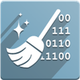

---
head:
  - - meta
    - name: title
      content: Odoo Wiki
    - name: description
      content: Umfassende Dokumentation der Odoo-Funktionen
tags: 
  - odoo
  - wiki
  - dokumentation
  - howto
  - referenz
  - prozesse
  - best-practice
---

# Odoo Wiki

Das Odoo Wiki beschreibt die Funktionen von [Odoo](https://www.odoo.com) auf zwei Ebenen. Die **Best Practice** beschreiben wie Anwendungsfälle in Odoo allgemein umgesetzt werden. Die **HowTos** sind detailliert beschriebene Arbeitsschritte zur Konfiguration und Verwendung von Odoo.

Die [Mint System GmbH](https://www.mint-system.ch/) unterhält das Odoo Wiki.

<!--## [Referenzsystem](Referenzsystem.md)

[Hier](Referenzsystem.md) geht es zum Referenzsystem.-->

## [Best Practice](Best%20Practice.md)

[Hier](Best%20Practice.md) geht es zu den Best Practice.

## HowTos

Für jede Odoo App finden Sie hier HowTos.

### [Abonnements](Abonnements.md)

Wiederkehrende Rechnungsstellung und Management von Abonnenten auf einfache Art und Weise.

### [Abrechnung](Abrechnung.md)

Online Rechnungsstellung leicht gemacht.

### [Abwesenheit](Abwesenheit.md)

Verwaltung von Mitarbeiterurlauben & Abwesenheit.

### [Aero Base](Aero%20Base.md)

Odoo für die Luftfahrt.

### [Anwesenheit](Anwesenheit.md)

Mitarbeitende erfassen selbständig ihre Präsenzzeit.

### [Apps](Apps.md)

Neue Apps installieren und aktualisieren.

### [Aufwand](Aufwand.md)

Spesen erfassen und abrechnen.

### [Aussendienst](Aussendienst.md)

Bieten Sie Ihren Kunden überall ausgezeichnete Dienstleistungen an.

### [Brand](Brand.md)

Mehrere Marken für ihr Unternehmen präsentieren.

### [Certificate Planner](Certificate%20Planner.md)

Anleitung zur Odoo-App Certificate Planner.

### [Contract](Contract.md)

Wiederholende Verträge verwalten und automatisch verrechnen.

### [Dashboards](Dashboards.md)

Dynamische Übersichten und Grafiken zu ihrem Unternehmen.

### [Data Cleaning](Data%20Cleaning.md)

Die Datenqualität ganz einfach verbessern.

### [Datenbankmanager](Datenbankmanager.md)

Odoo-Instanzen mit dem Datenbankmanager verwalten.

### [Datenmanagement](Datenmanagement.md)

Importieren und Exportieren Sie alle Odoo Daten.

### [Dokumente](Dokumente.md)

Sparen Sie Zeit beim Erfassen von Rechnungen, Scannen von Verträgen und bei der Freigabe von Dokumenten.

### [Diskussion](Diskussion.md)

In alle Module integrierter privater Chat und Gruppen-Chat.

### [Einkauf](Einkauf.md)

Verbessern Sie die Leistung Ihrer Lieferkette und Ihres Bestands.

### [Einkauf Kaufverträge](Einkauf%20Kaufverträge.md)

Kaufverträge für Rahmenbestellungen erstellen.

### [Einstellungen](Einstellungen.md)

Odoo-Einstellungen aktivieren und konfigurieren.

### [eLearning](eLearning.md)

Teilen Sie ihr Wissen mit der eLearning-Plattform.

### [E-Mail Marketing](E-Mail%20Marketing.md)

E-Mail-Marketing leicht gemacht.

### [Entwicklung](Entwicklung.md)

Odoo mühelos anpassen und erweitern.

### [Fertigung](Fertigung.md)

Eine moderne Lösung für ein altes Problem.

### [Finanzen](Finanzen.md)

Ihre Buchhaltung einfach und korrekt.

### [Fahrzeugflotte](Fahrzeugflotte.md)

Verwalten Sie mühelos Fahrzeuge, Verträge, Kosten, Versicherungen und Aufträge.

### [Forestry Base](Forestry%20Base.md)

Odoo für die Holzwirtschaft.

### [Initialisierung](Initialisierung.md)

Richten Sie ihre Odoo-Umgebung ein.

### [Installation](Installation.md)

Odoo installieren und konfigurieren.

### [IoT](IoT.md)

Alles, was das "Internet der Dinge (IoT)" bietet.

### [Kalender](Kalender.md)

Termine Team- und Anwendungs-übergreifend organisieren.

### [Knowledge](Knowledge.md)

Wissenstransfer für Teams vereinfachen.

### [Kontakte](Kontakte.md)

Alle Kontaktdaten an einem Ort.

### [Kundendienst](Kundendienst.md)

Für einen fantastischen Kundenservice.

### [Kundenverwaltung](Kundenverwaltung.md)

Verfolgen Sie Leads, schließen Sie Chancen ab und erhalten Sie genaue Prognosen.

### [Lager](Lager.md)

Maximieren Sie die Effizienz Ihres Lagers.

### [Link Tracker](Link%20Tracker.md)

Web-Kampagnen und E-Mails verfolgen.

### [Navigation](Navigation.md)

Alles zur Navigation in Odoo.

### [Notizen](Notizen.md)

Notizen zentral verwwalten.

### [Odoo Mobile App](Odoo%20Mobile%20App.md)

Alle Odoo-Funktionen auf ihrem Smartphone und Tablet.

### [Odoo.sh](Odoo.sh.md)

The Odoo Cloud Platform.

### [Order Positions](Order%20Positions.md)

Sammlung von Erweiterungen und Snippets um Positionsnummern auf Aufträge, Rechnungen und Lieferungen anzuzeigen.

### [Personal](Personal.md)

Personalmanagement für moderne Unternehmen.

### [Personalabrechnung](Personalabrechnung.md)

Personalbrechnungen schnell und einfach erstellen.

### [Personalbeschaffung](Personalbeschaffung.md)

Einstellungsprozess leicht gemacht.

### [Persönliche Einstellungen](Persönliche%20Einstellungen.md)

Einstellungen für ihren persönlichen Odoo-Benutzer.

### [PLM](PLM.md)

Management des Produktlebenszyklus für moderne Firmen.

### [Point of Sale](Point%20of%20Sale.md)

In wenigen Minuten einrichten, innerhalb von Sekunden verkaufen. 

### [Portal](Portal.md)

Kunden mit Odoo verbinden.

### [Projekt](Projekt.md)

Agiles Projektmanagement. Schön. Einfach. Open Source.

### [Strichcode](Strichcode.md)

Verfolgen Sie Aufträge, Produkte und Lieferungen mit Barcodes.

### [Studio](Studio.md)

Alles, was Sie zum Bauen benutzerdefinierter Anwendungen brauchen.

### [Troubleshooting](Troubleshooting.md)

Probleme und Lösungen rund um Odoo.

### [Umfragen](Umfragen.md)

Verbessern Sie mit Odoo Umfragen die Performance Ihrer Organisation.

### [Update](Update.md)

Aktualisieren Sie ihre Odoo Enterprise Installation ohne Mehrkosten.

### [Ventor PRO](Ventor%20PRO.md)

Android-App für die Lagerbewirtschaftung.

### [Verkauf](Verkauf.md)

Versenden Sie ausgefeilte Preisagebote mit Odoo Unterschrift und Online-Zahlung. 

### [Verkauf Rahmenverträge](Verkauf%20Rahmenverträge.md)

Rahmenverträge für Verkäufe erstellen.

### [Versand](Versand.md)

Versandmethoden und Logistik definieren.                                                                         

### [Warehouse](Warehouse.md)

Werkhallen und Warenhäuser effizient verwalten.

### [Wartung](Wartung.md)

Wartungs-Software für moderne Hersteller.

### [Website](Website.md)

Website Builder für Unternehmen. Einfach. Mobil. Open Source.

### [Website eCommerce](Website%20eCommerce.md)

Webshop ohne Integrationsaufwand.

### [Zeiterfassung](Zeiterfassung.md)

Verfolgen Sie die Zeit, prognostizieren Sie die Produktivität.

<!--## [Anforderungen](Anforderungen.md)

Die Evaluation eines ERP-Systems ist eine aufwändige Arbeit. Als Kunde ist man damit konfrontiert Anforderungen systematisch zu erfassen und den Lieferanten sinnvoll zu vermitteln. Als Lieferant erfordert die Analyse der Anforderungen viel Zeit. Die [Referenzanforderungen](Anforderungen.md) sollen den Abgleich mit einem Lastenheft vereinfachen.-->

## [Mitarbeit](Mitarbeit.md)

Sie können eine Kopie des Wiki erstellen und für eigene Zwecke nutzen. Ebenfalls können Sie Änderungen mitteilen und mit dem offizielen Wiki zusammenführen. Mehr dazu unter [Mitarbeit](Mitarbeit.md).

### Maintainer

Authoren werden hier mit Logo aufgeführt:

Es sind Dokumente von diesen Drittanbietern enthalten:

* [nivels GmbH](https://www.nivels.ch/)
* [giordano.ch](https://www.giordano.ch/)
* [syscoon GmbH](https://syscoon.com/)
* [Odoo Community Association](https://odoo-community.org/)
* [VentorTech](https://ventor.tech/)
* [Zebra](https://www.zebra.com)