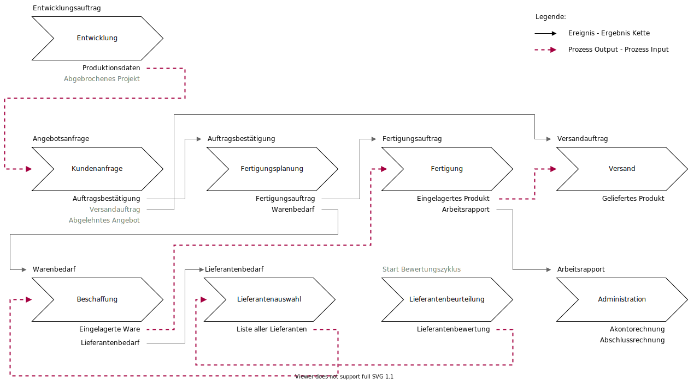

---
tags:
- Referenzsystem
---
# Referenzsystem

Das Mint System Referenzsystem ist die Beschreibung der Odoo-Funktionalität anhand einer prozessorientierten Beispiel-Organisation.
Diese Organisation ist als Prozesssystem mit Prozesslandkarte und Prozessen definiert.

## Prozesslandkarte

Die Prozesslandkarte ist die oberste Ebene des Prozesssystems. Sie zeigt in einer grafischen Übersicht alle Prozesse und deren Zusammenhänge.

Prozesse:
* [Produktentwicklung](Prozess-Produktentwicklung.md)
* [Verkauf](Prozess-Verkauf.md)
* [Beschaffung](Prozess-Beschaffung.md)
* [Betriebsdaten](Prozess-Betriebsdaten.md)
* [Abwesenheit](Prozess-Abwesenheit.md)
* [Finanzen](Prozess-Finanzen.md)

## Rollen

Die Prozessträger und Verwantwortliche werden anhand [Rollen](Rollen.md) identifiziert. Das Rollenkonzept zieht sich durch die gesamte Dokumentation.