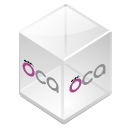

---
tags:
- HowTo
- OCA
prev: ./verkauf
---
# Sale Force Invoiced

Markieren Sie den Verkaufsauftrag als abgerechnet.

Technischer Name: `sale_force_invoiced`\
Repository: <https://github.com/OCA/sale-workflow/tree/14.0/sale_force_invoiced>

## Verwendung

### Verkaufsauftrag als abgerechnet markieren

Mit dieser Erweiterung können Sie einen Verkaufsauftrag unabhängig vom Abrechnungstatus als abgerechnet festlegen. Öffnen Sie *Verkauf > Abzurechnen > Zu fakturierende Aufträge* und wählen Sie den Auftrag, der nicht mehr als *Abzurechnen* erscheinen soll. Setzten Sie die Option *als abgerechnet markieren* im Tab *Weitere Informationen*.

