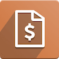

# Abonnements

{{ $frontmatter.description }}

Website: <https://www.odoo.com/de_DE/app/subscriptions>

## Erweiterungen

| Erweiterung                                                                               | Beschreibung                                                         |
| ----------------------------------------------------------------------------------------- | -------------------------------------------------------------------- |
| [Sale Subscription Disable Tokenization](Sale%20Subscription%20Disable%20Tokenization.md) | Abonnements mit Zahlungsanbieter ohne wiederkehrende Zahlung kaufen. |
| [Sale Subscription Partner Pricelist](Sale%20Subscription%20Partner%20Pricelist.md)       | Preislisten-Zugriff mit Abonnements erteilen.                        |
| [Sale Subscription Period Discount](Sale%20Subscription%20Period%20Discount.md)           | Erste Abonnementrechnung mit zeitbasiertem Rabatt.                   |

## Verwendung

### Abonnement-Vorlage erstellen

Rufen Sie die Ansicht *Abonnements > Konfiguration > Vorlage für Abonnements* auf. Erstellen Sie einen neuen Eintrag. Geben Sie einen Namen beispielsweise *Jahresabonnement* ein. Legen Sie den *Abrechnungszeitraum* und einen *Code* fest.

### Abonnement erstellen

Im Normalfall wird beim [Angebot bestätigen](Sale.md#Angebot%20bestätigen) ein Abonnement generiert. Wenn Sie ein Abonnement ohne Verkaufsauftrag erstellen möchten, navigieren Sie nach *Abonnement* und klicken auf *Neu*.

### Abonnement-Laufzeit mit Produktvariante verknüpfen

Öffnen Sie ein Abonnent-Produkt unter *Abonnements > Abonnements > Produkte*. Zeigen Sie den Tab *Preis* an. Legen Sie in der Spalte *Produktvarianten* fest, welche Laufzeit zu welcher Variante gehört. Dazu ein Beispiel.

### Abonnement-Laufzeit mit Produktvariante und Preisliste verknüpfen

Wenn Sie [Preislisten aktivieren](Sale%20Price.md#Preislisten%20aktivieren) und eine [Abonnement-Laufzeit mit ein Produktvariante verknüpfen](#Abonnement-Laufzeit%20mit%20Produktvariante%20verknüpfen), können Sie zusätzlich eine Preisliste auswählen.

Wenn Sie die ausgewählte [Preisliste anzeigen](Sale%20Price.md#Preisliste%20anzeigen) sehen Sie im Tab *Zeitbasierte Regel* die erstellten Verknüpfungen.