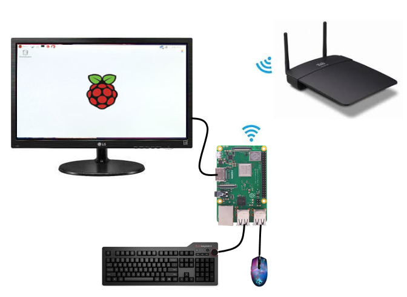
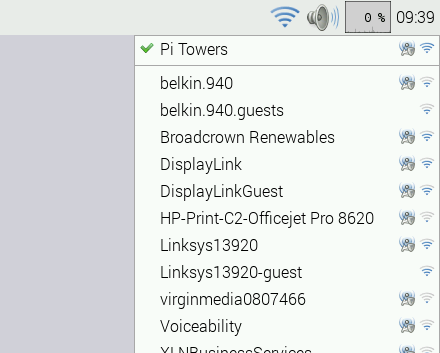

---
tags:
- HowTo
prev: ./zeiterfassung
---
# Terminal Zeiterfassung


Ein- und auschecken mit dem Terminal Zeiterfassung.

## Verwendung

::: tip
Das Terminal Zeiterfassung ist im wesentlichen ein Mini-Computer, der die Odoo-Installation im Browser anzeigt. Mit dem eingebauten Touchscreen kann mit der Odoo-Oberfläche direkt interagiert werden.
:::

### Terminal Zeiterfassung in Betrieb nehmen

Damit Sie das Terminal Zeiterfassung verwenden können, müssen Sie es zuerst mit dem Netzwerk verbinden. Gehen Sie wie folgt vor:

* Tastatur und Maus an Terminal anschliessen
* Terminal und Stromadapter anschliessen
* Das Terminal startet nun automatisch und zeigt den Startbildschirm



* Klicken Sie oben rechts auf das Wifi-Symbol
* Verbinden Sie das Terminal mit einem verfügbaren Router



* Starten Sie den Browser
* Geben Sie die Adresse zu ihrer Odoo-Installation ein
* Loggen Sie sich mit einem Service-Benutzer ein
* Zeigen Sie den Kiosk-Modus an
* Optional wechseln Sie mit <kbd>F11</kbd> in den Vollbildmodus

### Browser Autostart einrichten

Wenn Sie beim Starten des Terminal automatisch den Browser starten möchten, gehen Sie wie folgt vor. Offnen Sie das *Terminal* und geben Sie diesen Befehl ein:

```bash
nano ~/.config/autostart/chromiumstart.desktop
```

Kopieren oder fügen Sie diesen Ihnalt in die Datei:

```
[Desktop Entry]
Type=Application
Hidden=false
X-GNOME-Autostart-enabled=true
Comment=Start des Cromium Browsers
Name=chromiumstart
Exec=/usr/bin/chromium-browser --noerrdialogs --disable-session-crashed-bubble --disable-infobars --kiosk https://demo.odoo.com
```


###

Wählen Sie *Main Menu > Preferences > Main Menu Editor*. Anschliessend klicken Sie auf *Preferences* und aktivieren die Option *Desktop Session Settings*.


Nun können Sie die Autostart Programme unter *Main Menu > Preferences > Desktop Session Settings* im Tab *Automatically Started Applications* anzeigen.

### RFID-Karte registrieren

Damit Mitarbeiter sich mit einer RFID-Chip anmelden können, muss die Chip-Nummer hinterlegt werden.

Navigieren Sie nach *Personal* und führen Sie diese Aktionen aus:
* Mitarbeiter wählen
* Bearbeiten
* Tab HR Einstellungen öffnen
* Feld *Ausweis ID* auswählen
* RFID-Chip auf den Scanner legen
* Speichern

<iframe title="vimeo-player" src="https://player.vimeo.com/video/727928057?h=8278678305" width="640" height="360" frameborder="0" allowfullscreen></iframe>

### Mit RFID-Karte an- und abmelden

Mitarbeiter können mit einem registrierten RFID-Chip ein- und auschecken.

<iframe title="vimeo-player" src="https://player.vimeo.com/video/727928034?h=e73bd9eb0f" width="640" height="360" frameborder="0" allowfullscreen></iframe>