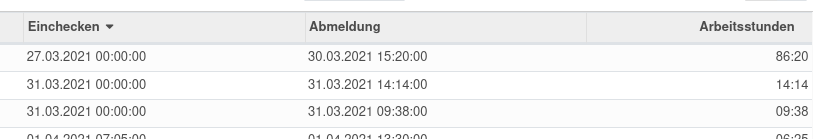

# Theoretical vs Attended Time Analysis

{{ $frontmatter.description }}

Technischer Name: `hr_attendance_report_theoretical_time`\
Repository: <https://github.com/OCA/hr-attendance/tree/17.0/hr_attendance_report_theoretical_time>

## Verwendung

### Startdatum festlegen

Das Startdatum der theoretischen Stunden kann pro MitarbieterIn festgelegt werden. Navigieren Sie nach *Personal > MitarbeiterIn auswählen* und legen Sie im Tab *HR Einstellungen* das Datum im Feld *Startdatum der theoretischen Stunden* fest.

### Offset definieren

Haben Mitarbeitende vor der Einführung des Überzeitenmanagement Übersstunden gesammelt, die übertragen werden müssen, gilt es für diese Stunden eine Anwesenheit zu erfassen.

Legen Sie als erstes pro Mitarbeiter das Startdatum der theoretischen Stunden fest. Erfassen Sie an den Tagen vor Beginn der theortischen Stunden zusätzliche Anwesenheiten. Wählen Sie das Eincheck- und Abmeldedatum sodass die Arbeitsstunden dem Überstundensaldo entsprechen.

### Abwesenheitsart in theoretischen Stunden einbeziehen

::: tip
Damit der Abwesenheitsart in der Auswertung [Theoretical vs Attended Time Analysis](Theoretical%20vs%20Attended%20Time%20Analysis.md) berücksichtigt wird, muss dies explizit festgelegt werden.
:::

Öffnen Sie den Abwesenheitsart mit *Abwesenheiten > Konfiguration > Abwesenheitsarten*. Bearbeiten Sie den Typ und wählen Sie die Checkbox *in theoretische Stunden einbeziehen* unter *Optionen*. Schliessen Sie den Vorgang ab. Nun wird der Abwesenheitsart in der theoretischen Stunden berücksichtigt.

### Theoretische und tatsächliche Anwesenheiten vergleichen

Navigieren Sie nach *Anwesenheiten > Berichtswesen > Theoretische vs. tatsächliche Anwesenheitszeiten > Angestellt wählen*. Fügen Sie die Mitarbeiter deren Zeiten Sie auswerten wollen der Liste *Angestellte* hinzu. Zeigen Sie den Bericht mit *Bericht ansehen* an.

Falls Sie direkt den eigenen Vergleich sehen möchten wählen Sie direkt *Alle Angestellte*. Standardmässig wird die Ansicht nach dem eigenen Benutzer gefiltert.

### Abwesenheitsart "Überstunden kompensieren" anlegen

Damit Mitarbeiter ihre Überstunden kompensieren können, braucht es einen entsprechenden Abwesenheitsart.

Navigieren Sie nach *Abwesenheiten > Konfiguration > Abwesenheitsarten* und erstellen einen neuen Eintrag. Wählen Sie als *Work Entry Type*: *Anwesend* und für *Einheit der Abwesenheit*: *Stunden*.

Über den normalen Genemigungsprozess können so Mitarbeiter ihre Überstunden als Anwesenheit registrieren lassen.

### Überstunden beziehen

Möchte ein Mitarbeiter seine Überstunden beziehen, gibt er diese als Abwesenheit ein. Angenommen man hat 00:29 Überstunden, so öffnet man als erstes die *Abwesenheitszeiten.*

Hier wählt man *Neuer Abwesenheitsantrag* und als Typ *Überstunden kompensieren*. Wurde der Abwesenheitsantrag angenomme und gespeichert, wird dies als Arbeitszeit berücksichtigt.

