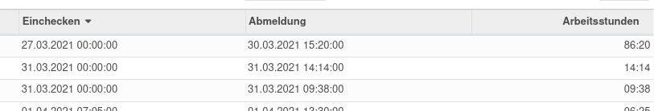

---
tags:
- HowTo
- OCA
---
# Theoretical vs Attended Time Analysis

Erstellen sie Berichte zu den effektiv gearbeiteten und den theoretischen Stunden. Ideal für Überzeitenmanagement.

Technischer Name: `hr_attendance_report_theoretical_time`\
Repository: <https://github.com/OCA/hr-attendance/tree/13.0/hr_attendance_report_theoretical_time>

Erweiterungen:
* [HR Holidays Public](HR-Holidays-Public.md)

## Startdatum festlegen

Das Startdatum der theoretischen Stunden kann pro MitarbieterIn festgelegt werden. Navigieren sie nach *Personal > MitarbeiterIn auswählen* und legen sie im Tab *HR Einstellungen* das Datum im Feld *Startdatum der theoretischen Stunden* fest.

## Offset definieren

Haben Mitarbeitende vor der Einführung des Überzeitenmanagement Übersstunden gesammelt, die übertragen werden müssen, gilt es für diese Stunden eine Anwesenheit zu erfassen.

Legen sie als erstes pro Mitarbeiter das Startdatum der theoretischen Stunden fest. Erfassen sie an den Tagen vor Beginn der theortischen Stunden zusätzliche Anwesenheiten. Wählen sie das Eincheck- und Abmeldedatum sodass die Arbeitsstunden dem Überstundensaldo entsprechen.

## Abwesenheitstyp in theoretischen Stunden einbeziehen

::: tip
Damit der Abwesenheitstyp in der Auswertung [Theoretical-vs-Attended-Time-Analysis](Theoretical-vs-Attended-Time-Analysis.md) berücksichtigt wird, muss dies explizit festgelegt werden.
:::

Öffnen Sie den Abwesenheitstyp mit *Abwesenheitszeiten > Konfiguration > Abwesenheitstypen*. Bearbeiten sie den Typ und wählen sie die Checkbox *in theoretische Stunden einbeziehen* unter *Optionen*. Schliessen sie den Vorgang ab. Nun wird der Abwesenheitstyp in der theoretischen Stunden berücksichtigt.

## Theoretische und tatsächliche Anwesenheitszeiten vergleichen

Navigieren sie nach *Anwesenheitszeiten > Berichtswesen > Theoretische vs. tatsächliche Anwesenheitszeiten > Angestellt wählen*. Fügen sie die Mitarbeiter deren Zeiten sie auswerten wollen der Liste *Angestellte* hinzu. Zeigen sie den Bericht mit *Bericht ansehen* an.

Falls sie direkt den eigenen Vergleich sehen möchten wählen sie direkt *Alle Angestellte*. Standardmässig wird die Ansicht nach dem eigenen Benutzer gefiltert.

