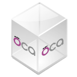

# URL Attachment

Url als Dokument anhängen.

Technischer Name: `document_url`\
Repository: <https://github.com/OCA/knowledge/tree/14.0/document_url>

## Verwendung

### Url als Dokument hinzufügen

Mit dieser Erweiterungen können sie, nicht nur Dokumente im Chatter anhängen, sondern auch Urls. Öffnen Sie eine beliebige Formular-Ansicht mit einem Chatter-Fenster und wählen *Add URL*.

Geben Sie einen Link-Namen und die Url ein. 

Die Url wird als Dokument angezeigt.

