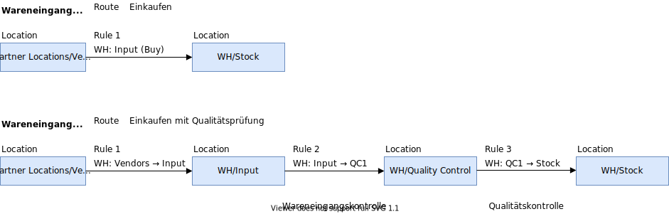
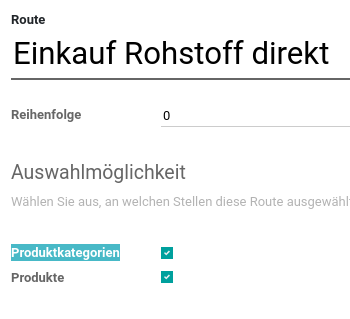
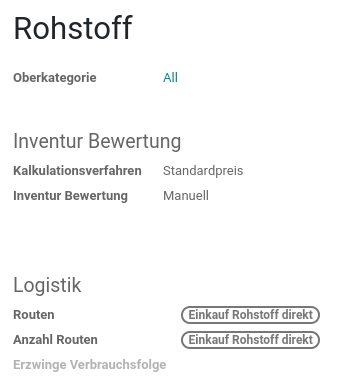

# Use Case - Schokoladenfabrik

In der Lebensmittelbranche müssen mehrstufige Qualitätskontrollen für Rohstoffe, Halbfabriakte und Fertigprodukte absolviert werden. In diesem Use Case wird beschrieben wie mit Odoo mehrstufige Routen für den Einkauf, die Fertigung und das Lager konfiguriert werden und wie diese mit der Qualitätskontrolle verknüpft werden.

## Ausgangslage

Die Situation ist übersichtlich. Der Kunde wünscht die Implementation der folgenden Prozesse:

## Implementation

Die Implementation in Odoo erfordert die Installation von Apps, Festlegen von Einstellungen und Konfiguration der MRP-Objekte.

### Odoo Apps

Installieren Sie die folgenden Apps:
* `mrp_workorder`
* `stock`
* `quality_control`
* `quality_mrp_workorder`
* `contacts`
* `purchase`
* `mail_enterprise`

### Odoo Settings

Aktivieren Sie diese Einstellungen:
* Mengeneinheiten
* Lagerorte
* Mehrstufige Routen
* Arbeitsaufträge
* Los- und Seriennummern

### Kontakt

Legen Sie mindestens diese Kontakte an:
Unternehmen: Schokoladenfabrik\
Lieferant: Kakao ACME

### Lager

Das Standardlager ist wie folgt konfiguriert:

**Zürch: WH**
* Wareneingang: 3 steps
* Ausgehende Lieferungen: 2 steps
* Fertigung: 3 steps

### Lagerorte

Legen Sie diese Lagerort an:
* Hauptlager: WH/Stock
* Eingangslager: WH/Input
* Qualitätskontrolle: WH/QC1
* Qualitätskontrolle 2: WH/QC5

### Produktkategorien

Legen Sie diese Produktkategorien an:
* Rohstoff QC
* Rohstoff
* Halbfabrikat QC
* Halbfabrikat
* Fertigprodukt QC
* Fertigprodukt

### Produkte

Im folgenden sind die Produkte und deren Konfiguration gruppiert nach Produktkategorie aufgeführt.

Rohstoffe QC:

* **Kakaobohnen** kg
  * Route: Einkauf Rohstoff mit Q-Prüfung
  * Lieferant: Kakao ACME, 1CHF
  * Kategorie: Rohstoff QC
  * Nachverfolgung: mittels Chargen
* **Kakaobutter** kg
  * Route: Einkauf Rohstoff mit Q-Prüfung
  * Lieferant: Kakao ACME, 1CHF
  * Kategorie: Rohstoff QC

Rohstoffe (Input):

* **Zucker** kg
  * Route: Einkauf Rohstoff direkt
  * Lieferant: Kakao ACME, 1CHF
  * Kategorie: Rohstoffe
* **Flüssigkeit** L
  * Kategorie: Rohstoffe

Halbfabrikat QC:

* **Kakaopulver** 1kg
	* Route: Fertigung Halbfabrikat mit Q-Prüfung
	* Katgeorie: Halbfabrikat QC
	* BoM:
		* Route:
		* Komponenten:
			* 2kg Kakaobohnen

Halbfabrikat:

* **Karamell** 1kg
  * Route: Fertigung Halbfabrikat direkt
  * Kategorie: Halbfabrikat
  * BoM:
	  * Route: Fertigung Halbfabrikat direkt
	  * Komponenten:
		* 1kg Zucker

Fertigprodukt QC:

* **Schokoladentafel** 1 Einheit (100g)
  * Route: Fertigung Fertigprodukt mit Q-Prüfung
  * Kategorie: Fertigprodukt QC
  * Nachverfolgung: mittels Chargen
  * BoM:
	  * Route:
	  * Komponenten:
		* 50g Kakaobutter
		* 40g Kakaopulver
		* 10g Zucker

Fertigprodukt:

* **Karamellcreme** 1kg
  * Route: Fertigung Fertigprodukt direkt
  * Kategorie: Fertigprodukt
  * BoM:
	  * Route:
	  * Komponenten:
		* 500g Karamell
		* 0.5L Flüssigkeit

### Routen

Ein Beispiel wie mehrstufige Routen aussehen:

Konfigurieren Sie diese Routen:

* **Einkauf Rohstoff direkt**
  * Name: WH: QC1 (buy)
    * Einkaufen: → WH/Stock
    * Vorgangstyp: Zürch: **Anlieferung**
    * Lager: Zürch
* **Einkauf Rohstoff mit Q-Prüfung**
  * Name: WH: QC1 (Buy)
    * Einkaufen: → WH/QC1
    * Vorgangstyp: Zürch: **Anlieferungen Q1**
    * Lager: Zürch
  * Name:
    * Holen & Schieben nach: WH/QC1 → WH/Stock
    * Vorgangstyp: Zürch: **Interne Transfers Q1**
    * Lager: Zürch
* **Fertigung Fertigprodukt direkt**
  * Name: WH: Post-Production (Production)
    * Fertigung: → WH/Stock
    * Vorgangstyp: Zürch: **Manufacturing**
    * Lager: Zürch
* **Fertigung Fertigprodukt mit Q-Prüfung**
  * Name: WH: QC5 (Production)
    * Fertigung: WH Stock → WH/QC5
    * Vorgangstyp: Zürch: **Manufacturing Q5**
    * Lager: Zürch
  * Name:
    * Holen & Schieben nach: WH/QC5 → WH/Stock
    * Vorgangstyp: Zürch: **Store Finished Product Q5**
    * Lager: Zürch

Optional konfigurieren Sie diese Routen:

* **Fertigung Halbfabrikat mit Q-Prüfung**
	* Name:
		  * Fertigung: -> WH/QC5
		  * Holen & Schieben nach: WH/QC5 -> WH/Stock
		  * Lager: Zürch
* **Fertigung Halbfabrikat direkt**
	* Name:
	  * Fertigung: -> WH/Stock
	  * Lager: Zürch

### Arbeitsplätze

Legen Sie diese Arbeitsplätze an:
* Verarbeitung
* Produktion

### Vorgangstyp

Die Konfiguration der Vorgangstypen ist zentral in diesem Use Case.

Anpassen Vorgangstypen:

**Anlieferung**
* Standard Quellort:
* Standard Zielort WH/Stock
* Code: IN
* Nächste Bewegung abbrechen: Falsch

Zusätzliche Vorgangstypen:

**Anlieferung QC1**
* Standard Quellort:
* Standard Zielort WH/QC1
* Code: INQ
* Nächste Bewegung abbrechen: Falsch

**Interne Transfers QC1**
* Standard Quellort: WH/QC1
* Standard Zielort: WH/Stock
* Code: INTQ
* Nächste Bewegung abbrechen: Falsch

**Manufacturing QC5**
* Standard Quellort: WH/Stock
* Standard Zielort: WH/QC5
* Code: MOQ
* Nächste Bewegung abbrechen: Falsch

**Store Finished Product QC5**
* Standard Quellort: WH/QC5
* Standard Zielort: WH/Stock
* Code: SFPQ
* Nächste Bewegung abbrechen: Falsch

### Vorgänge

Für die Fertigung der Halbfabrikate und Fertigprodukte gibt es diese Arbeitsvorgänge gruppiert nach Arbeitsplatz.

**Arbeitsplatz: Verarbeitung**

Produktion Kakaopulver:
* Kakaobohnen verarbeiten

**Arbeitsplatz: Produktion**

Produktion Schokoladentafel:
* Kakaopulver hinzufügen
* Kakaobutter hinzufügen
* Zucker hinzufügen
* Schokoladentafel fertigen

Produktion Karamell:
* Zucker aufkochen

Produktion Karamellcreme:
* Karamell hinzufügen
* Mit Flüssigkeit aufkochen

### Qualitätsteams

Legen Sie diese Qualitätsteams an:
* QC1-Team
* QC5-Team

### Qualitätsprüfpunkte

Zur Prüfung der Ware müssen Qualitätsprüfpunkte unten erstellt werden.

**Q-Prüfung Rohstoffe Anlieferung**
* Titel: Ware prüfen
* Anleitung: Prüfen Sie die Ware.
* Vorgänge: Anlieferung QC1
* Team: QC1-Team

**Q-Prüfung Rohstoffe QC1**
* Titel: Qualität prüfen
* Anleitung: Prüfen Sie die Qualität.
* Vorgänge: Interne Transfers QC1
* Team: QC1-Team

**Q-Prüfung Fertigung QC5**
* Titel: Qualität prüfen
* Anleitung: Prüfen Sie die Qualität.
* Vorgänge: Store Finished Product QC5
* Team: QC5-Team

## Ausführung

Ist die Implementation erfolgt, können Sie den Use Case mit den folgenden Instruktionen ausführen.

### Rohstoff mit Q-Prüfung

<iframe src="https://player.vimeo.com/video/727166995?h=6fc37efbe4" width="640" height="298" frameborder="0" allow="autoplay; fullscreen; picture-in-picture" allowfullscreen></iframe>

<a href="https://vimeo.com/727166995">Ausf&uuml;hrung Rohstoff mit Q-Pr&uuml;fung</a> from <a href="https://vimeo.com/janikvonrotz">Janik Vonrotz</a> on <a href="https://vimeo.com">Vimeo</a>.

1. Produkt Kakaobohnen auffüllen mit entsprechender Route
2. Öffnen *Lager > Anlieferungen QC1* und auswählen Transfer
3. Klick auf *Qualitätskontrollen* und *Bestanden*

4. Transfer bestätigen
5. Öffnen *Lager > Interner Transfer QC1* und auswählen Transfer
6. Klick auf *Qualitätskontrollen* und *Bestanden*

### Fertigung mit Q-Prüfung

<iframe src="https://player.vimeo.com/video/727166963?h=b2f638cd21" width="640" height="294" frameborder="0" allow="autoplay; fullscreen; picture-in-picture" allowfullscreen></iframe>

<a href="https://vimeo.com/727166963">Ausf&uuml;hrung Fertgiung mit Q-Pr&uuml;fung.mp4</a> from <a href="https://vimeo.com/janikvonrotz">Janik Vonrotz</a> on <a href="https://vimeo.com">Vimeo</a>.

1. Produkt Schokoladentafel auffüllen mit entsprechender Route
2. Fertigungsauftrag ausführen
3. Öffnen *Lager > Store Finished Product QC5* und auswählen Transfer
4. Klick auf *Qualitätskontrollen* und *Bestanden*

### Einkauf Rohstoff direkt

<iframe src="https://player.vimeo.com/video/727166969?h=6b7a576d6d" width="640" height="294" frameborder="0" allow="autoplay; fullscreen; picture-in-picture" allowfullscreen></iframe>

<a href="https://vimeo.com/727166969">Ausf&uuml;hrung Rohstoff direkt</a> from <a href="https://vimeo.com/janikvonrotz">Janik Vonrotz</a> on <a href="https://vimeo.com">Vimeo</a>.

## Kommentar

Es bestehen Erläuterungen zum Use Case.

**Retouren**

Auf Vorgangstypen kann ein Vorgangstyp für Retouren festgelegt werden. Beispielsweise kann auf *Anlieferung* eine Rücklieferung erfasst werden.

**Route auf Kategorien**

Zur Frage, ob die Route auf der Kategorie festgelegt werden kann ist die Antwort Ja.

Auf Route die Option *Produktkategorie* aktivieren:

Auf Prdouktkategorie die entsprechende Route wählen:

Es ist zu empfehlen, dass Routen entweder über Produkte oder Produkkategorien definiert werden.