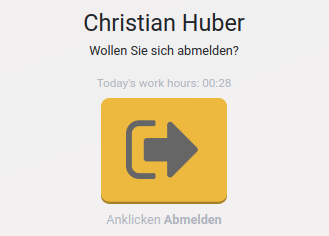

# Anwesenheitszeiten

::: tip
Odoo unterscheidet Anwesenheit und Projektzeit. Die Zeiterfassung für Anwesenheit erfolgt mit der App Anwesenheit. Für das Erfassen der Projektzeit nutzt man die App Zeiterfassung.
:::

## Anwesenheit anmelden
Navigieren sie nach *Anwesenheitszeiten* und klicken sie auf den Knopf *Anmelden*.

Es erscheint ein Willkommensgruss mit Angabe der Uhrzeit.

## Anwesenheit abmelden
Navigieren sie nach *Anwesenheitszeiten* und klicken sie auf den Knopf *Abmelden*.

Es erscheint eine Verabschiedung mit Angabe der geleisteten Arbeitszeit.

## Anwesenheitszeiten anzeigen
Der kürzeste Weg zur Anzeige der rapprtierten Arbeitszeit führt über *My Profile*.
Navigieren Sie zum Knopf mit ihrem Namen auf dem Bildschirm oben rechts.
Dort wählen Sie *Vorname Nachname > My Profile*. Es erscheint die folgende Maske:

Ein Klick auf den Smart-Button *n Stunden* zeigt eine Tabelle mit den Details.

Ausführlichere Informationen bietet das Berichtswesen in der App Zeiterfassung.
Navigieren Sie nach *Zeiterfassung > Berichtswesen* und wählen Sie das Menü *Zeiterfassung / Anwesenheit*.

Mit dem Knopf *Werte* können Spalten ein- und ausgeblendet werden.

::: tip
Das detaillierte Protokoll der An- und Abmeldungen zeigt die Übersicht *Anwesenheitszeiten > Manager > Anwesenheitszeiten*. (Die Berechtigung Personalsachbearbeiter ist notwendig.)
:::

## Theoretische und tatsächliche Anwesenheitszeiten vergleichen

::: warning
Diese Aktion erfordert die Installation der Erweiterung *Theoretical vs Attended Time Analysis*.
:::

Navigieren sie nach *Anwesenheitszeiten > Berichtswesen > Theoretische vs. tatsächliche Anwesenheitszeiten > Angestellt wählen*. Fügen sie die Mitarbeiter deren Zeiten sie auswerten wollen der Liste *Angestellte* hinzu. Zeigen sie den Bericht mit *Bericht ansehen* an.

Falls sie direkt den eigenen Vergleich sehen möchten wählen sie direkt *Alle Angestellte*. Standardmässig wird die Ansicht nach dem eigenen Benutzer gefiltert.

[📝 Edit on GitHub](///////https://github.com/mint-system/odoo-handbuch/blob/master/anwesenheitszeiten.html.html.html.html.html.html.html)

<footer>Copyright © <a href="https://www.mint-system.ch/">Mint System GmbH</a></footer>

[📝 Edit on GitHub](//////https://github.com/mint-system/odoo-handbuch/blob/master/anwesenheitszeiten.html.html.html.html.html.html)

<footer>Copyright © <a href="https://www.mint-system.ch/">Mint System GmbH</a></footer>

[📝 Edit on GitHub](/////https://github.com/mint-system/odoo-handbuch/blob/master/anwesenheitszeiten.html.html.html.html.html)

<footer>Copyright © <a href="https://www.mint-system.ch/">Mint System GmbH</a></footer>

[📝 Edit on GitHub](////https://github.com/mint-system/odoo-handbuch/blob/master/anwesenheitszeiten.html.html.html.html)

<footer>Copyright © <a href="https://www.mint-system.ch/">Mint System GmbH</a></footer>

[📝 Edit on GitHub](///https://github.com/mint-system/odoo-handbuch/blob/master/anwesenheitszeiten.html.html.html)

<footer>Copyright © <a href="https://www.mint-system.ch/">Mint System GmbH</a></footer>

[📝 Edit on GitHub](//https://github.com/mint-system/odoo-handbuch/blob/master/anwesenheitszeiten.html.html)

<footer>Copyright © <a href="https://www.mint-system.ch/">Mint System GmbH</a></footer>

[📝 Edit on GitHub](/https://github.com/mint-system/odoo-handbuch/blob/master/anwesenheitszeiten.html)

<footer>Copyright © <a href="https://www.mint-system.ch/">Mint System GmbH</a></footer>

[📝 Edit on GitHub](https://github.com/Mint-System/Odoo-Handbuch/blob/master/anwesenheitszeiten.md)

<footer>Copyright © <a href="https://www.mint-system.ch/">Mint System GmbH</a></footer>