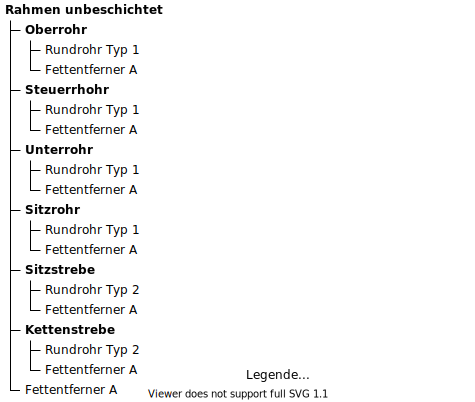
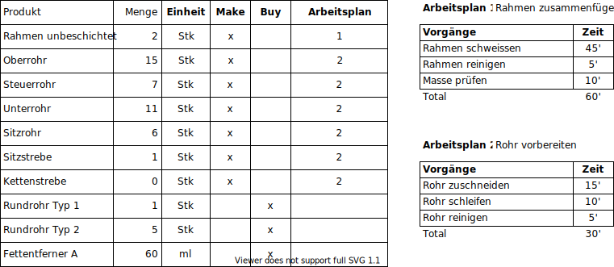

# Definition Beispiel Fahrrad

## Rahmen unbeschichtet

### Produkt-Struktur

(Siehe auch [Item Structure](////////best-practice-item-structure.html.html.html.html.html.html.html.html))

### Stückliste

Rahmen unbeschichtet

### Lagerbestand/Arbeitspläne

### Stammdaten/Einkaufsinformationen

### Lead Times

### Meldebestände

[📝 Edit on GitHub](///////https://github.com/mint-system/odoo-handbuch/blob/master/best-practice-definition-beispiel-fahrrad.html.html.html.html.html.html.html)

<footer>Copyright © <a href="https://www.mint-system.ch/">Mint System GmbH</a></footer>

[📝 Edit on GitHub](//////https://github.com/mint-system/odoo-handbuch/blob/master/best-practice-definition-beispiel-fahrrad.html.html.html.html.html.html)

<footer>Copyright © <a href="https://www.mint-system.ch/">Mint System GmbH</a></footer>

[📝 Edit on GitHub](/////https://github.com/mint-system/odoo-handbuch/blob/master/best-practice-definition-beispiel-fahrrad.html.html.html.html.html)

<footer>Copyright © <a href="https://www.mint-system.ch/">Mint System GmbH</a></footer>

[📝 Edit on GitHub](////https://github.com/mint-system/odoo-handbuch/blob/master/best-practice-definition-beispiel-fahrrad.html.html.html.html)

<footer>Copyright © <a href="https://www.mint-system.ch/">Mint System GmbH</a></footer>

[📝 Edit on GitHub](///https://github.com/mint-system/odoo-handbuch/blob/master/best-practice-definition-beispiel-fahrrad.html.html.html)

<footer>Copyright © <a href="https://www.mint-system.ch/">Mint System GmbH</a></footer>

[📝 Edit on GitHub](//https://github.com/mint-system/odoo-handbuch/blob/master/best-practice-definition-beispiel-fahrrad.html.html)

<footer>Copyright © <a href="https://www.mint-system.ch/">Mint System GmbH</a></footer>

[📝 Edit on GitHub](/https://github.com/mint-system/odoo-handbuch/blob/master/best-practice-definition-beispiel-fahrrad.html)

<footer>Copyright © <a href="https://www.mint-system.ch/">Mint System GmbH</a></footer>

[📝 Edit on GitHub](https://github.com/Mint-System/Odoo-Handbuch/blob/master/best-practice-definition-beispiel-fahrrad.md)

<footer>Copyright © <a href="https://www.mint-system.ch/">Mint System GmbH</a></footer>