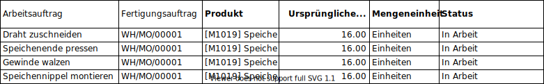

# Fertigungsauftrag

## Spezialfall Teilmenge einlagern
### Anforderung
Ein Fertigungsauftrag für eine bestimmte Menge N eines Produktes wird ausgelöst. Bevor der Auftrag abgeschlossen ist, soll eine Teilmenge B des fertiggestellten Produkts eingelagert werden. Der Auftrag soll offen bleiben, bis die restliche Menge A-B ebenfalls fertiggestellt ist.

### Beispiel
Der Fertigungsauftrag WH/MO/00001 für 16 Stk des Artikels *Speiche* wird auf folgender Basis geplant:

Daraus entstehen vier Arbeitsaufträge:

Die Arbeitsaufträge werden der Reihe nach bearbeitet  (*Prozess*) und mit der Teilmenge B abgeschlossen. Sie bleiben damit im Status *In Arbeit* und es zeigt sich folgende Situation:

::: tip
Das sequenzielle Abarbeiten von nicht abgeschlossenen Arbeitsaufträgen funktioniert nur, wenn im entsprechenden Arbeitsplan folgende Option eingeschaltet ist: *Start Next Operation: Sobald einige Produkte verarbeitet sind*
:::

Im Fertigungsauftrag WH/MO/00001 erscheinen die abgeschlossenen Produkte der Menge B im Register Fertigprodukte. Mit der Funktion *Bestandänderung Buchen* werden die fertiggestellten Produkte ans Lager gebucht. Die noch offenen Arbeitsaufträge können mit der Menge A-B weiter bearbeitet und der Auftrag dann vollständig abgeschlossen werden.

::: tip
Die Funktion *Bestandänderung Buchen* erscheint nur, wenn der Entwicklermodus eingeschaltet ist.
:::

[📝 Edit on GitHub](///////https://github.com/mint-system/odoo-handbuch/blob/master/best-practice-fertigungsauftrag.html.html.html.html.html.html.html)

<footer>Copyright © <a href="https://www.mint-system.ch/">Mint System GmbH</a></footer>

[📝 Edit on GitHub](//////https://github.com/mint-system/odoo-handbuch/blob/master/best-practice-fertigungsauftrag.html.html.html.html.html.html)

<footer>Copyright © <a href="https://www.mint-system.ch/">Mint System GmbH</a></footer>

[📝 Edit on GitHub](/////https://github.com/mint-system/odoo-handbuch/blob/master/best-practice-fertigungsauftrag.html.html.html.html.html)

<footer>Copyright © <a href="https://www.mint-system.ch/">Mint System GmbH</a></footer>

[📝 Edit on GitHub](////https://github.com/mint-system/odoo-handbuch/blob/master/best-practice-fertigungsauftrag.html.html.html.html)

<footer>Copyright © <a href="https://www.mint-system.ch/">Mint System GmbH</a></footer>

[📝 Edit on GitHub](///https://github.com/mint-system/odoo-handbuch/blob/master/best-practice-fertigungsauftrag.html.html.html)

<footer>Copyright © <a href="https://www.mint-system.ch/">Mint System GmbH</a></footer>

[📝 Edit on GitHub](//https://github.com/mint-system/odoo-handbuch/blob/master/best-practice-fertigungsauftrag.html.html)

<footer>Copyright © <a href="https://www.mint-system.ch/">Mint System GmbH</a></footer>

[📝 Edit on GitHub](/https://github.com/mint-system/odoo-handbuch/blob/master/best-practice-fertigungsauftrag.html)

<footer>Copyright © <a href="https://www.mint-system.ch/">Mint System GmbH</a></footer>

[📝 Edit on GitHub](https://github.com/Mint-System/Odoo-Handbuch/blob/master/best-practice-fertigungsauftrag.md)

<footer>Copyright © <a href="https://www.mint-system.ch/">Mint System GmbH</a></footer>