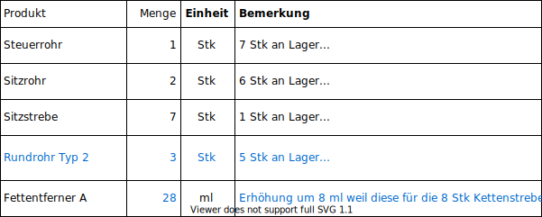

# Replenishment

## Beispiel
An den Kunden *Fahrrad-Traum AG* werden 10 Stk *Rahmen unbeschichtet* verkauft.

Als Liefertermin wird das als *Expected* vorgeschlagene Datum *Heute + 1 Tag* gesetzt. (Das gründet auf der Definition *Auslieferungszeit* = 1 Tag. Details zur Produktdefinition siehe [Definition Beispiel Fahrrad](////////best-practice-definition-beispiel-fahrrad.html.html.html.html.html.html.html.html))

### Ablauf

Nach der Bestätigung des Auftrags erscheint der Vorschlag 8 Stk zu produzieren in der Liste von *Replenishment*.

Der Auftrag wird mit *Order Once* bestätigt und damit der *WH/MO/00001* automatisch erstellt. Unmittelbar darauf erscheint die erweiterte Liste mit den folgenden neuen Vorschlägen.

Mit dem Bestätigen des Auftrages *Kettenstrebe* wird der Auftrag *WH/MO/00002* erstellt, die  zusätzliche Position *Rundrohr Typ 2* erscheint und die Quantität des *Fettentferner A* wird um 8 ml erhöht.

Mit der Beauftragung des Steuerrohrs wird der Auftrag *WH/MO/00003* erstellt und die Liste verändert sich bezüglich Quantitä des *Fettentferner A*.

Sobald der Auftrag *Sitzrohr* bestätigt wird (automatischer Auftrag *WH/MO/00004*) erscheint die zusätzliche Position für das Produkt *Rundrohr Typ 1*. Die Position *Fettentferner A* wird bezüglich Quantität von 20 auf 31 ml erhöht:

Mit der nächsten Bestätigung (automatischer Auftrag *WH/MO/00005*) werden die Quantitäten für die Positionen *Rundrohr Typ 2* und *Fettentferner A* erhöht und die Bestellvorschläge P00001 und P00002 erstellt. (P00001 hat zwei Positionen.)

Anschliessend ist die Liste leer.

Die beiden Bestellvorschläge P00001 und P00002 werden nun bestätigt. Jetzt ist sämtliches Material bestellt.

[📝 Edit on GitHub](///////https://github.com/mint-system/odoo-handbuch/blob/master/best-practice-replenishment.html.html.html.html.html.html.html)

<footer>Copyright © <a href="https://www.mint-system.ch/">Mint System GmbH</a></footer>

[📝 Edit on GitHub](//////https://github.com/mint-system/odoo-handbuch/blob/master/best-practice-replenishment.html.html.html.html.html.html)

<footer>Copyright © <a href="https://www.mint-system.ch/">Mint System GmbH</a></footer>

[📝 Edit on GitHub](/////https://github.com/mint-system/odoo-handbuch/blob/master/best-practice-replenishment.html.html.html.html.html)

<footer>Copyright © <a href="https://www.mint-system.ch/">Mint System GmbH</a></footer>

[📝 Edit on GitHub](////https://github.com/mint-system/odoo-handbuch/blob/master/best-practice-replenishment.html.html.html.html)

<footer>Copyright © <a href="https://www.mint-system.ch/">Mint System GmbH</a></footer>

[📝 Edit on GitHub](///https://github.com/mint-system/odoo-handbuch/blob/master/best-practice-replenishment.html.html.html)

<footer>Copyright © <a href="https://www.mint-system.ch/">Mint System GmbH</a></footer>

[📝 Edit on GitHub](//https://github.com/mint-system/odoo-handbuch/blob/master/best-practice-replenishment.html.html)

<footer>Copyright © <a href="https://www.mint-system.ch/">Mint System GmbH</a></footer>

[📝 Edit on GitHub](/https://github.com/mint-system/odoo-handbuch/blob/master/best-practice-replenishment.html)

<footer>Copyright © <a href="https://www.mint-system.ch/">Mint System GmbH</a></footer>

[📝 Edit on GitHub](https://github.com/Mint-System/Odoo-Handbuch/blob/master/best-practice-replenishment.md)

<footer>Copyright © <a href="https://www.mint-system.ch/">Mint System GmbH</a></footer>