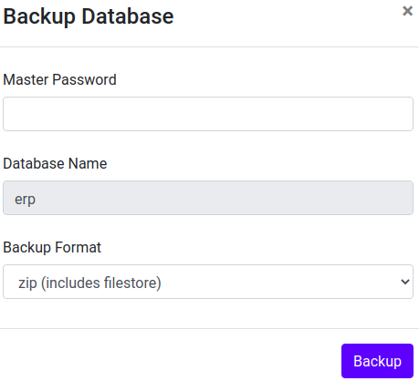
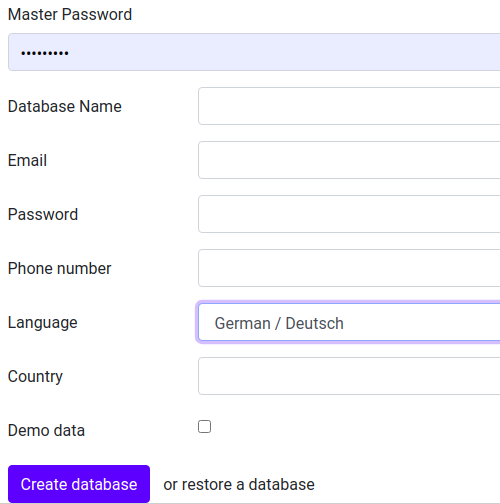

# Datenbankmanager

Zur Verwaltung der Odoo-Instanzen gibt es den Datenbankmanager. Dieses Tool erlaubt ein Backup von der Instanz zu erstellen und nach Bedarf wiederherzustellen.

## Datenbank erstellen
Möchten sie eine Datenbank für ihre Odoo-Installation erstellen, öffnen sie den Datenbankmanager unter https://erp.example.com/web/database/manager und geben die folgenden Daten ein.

* Master Password: Dieses Passwort ist vordefiniert
* Database Name: `erp`

Der Name der Datenbank muss gleich der Subdomain/Domain sein. Beispiel:  
https://erp.example.com -> `erp`  
https://www.example.com -> `example`  Das *www* wird ignoriert

* Email: `admin@example.com`
* Password: Passwort des Odoo Administrators
* Phone number: Telefonnumer des Unternehmens
* Language: `German (CH)/ Deutsch (CH)` Nicht zu verwechseln mit *German / Deutsch*
* Country: `Switzerland`
* Demo data: `deaktiviert` Achtung: Bei aktivierter Checkbox wird die Datenbank unwiderruflich mit Demo-Daten gefüllt

::: tip
Der Eintrag im Feld Email wird automatisch zum Login des Standard-Benutzers *Administrator*.
:::

Drücken Sie den Knopf *Create Database* zum Erstellen der neuen Datenbank.
Die Funktion "Restore Database" führt Sie zu einem Dialog um eine bestehende Datenbank zu importieren.

## Backup erstellen

Der Datenbank Manager kann unter der URL https://erp.example.com/web/database/manager aufgerufen werden. Hier werden die Odoo-Instanzen aufgelistet. Beim Klick auf *Backup* wird man aufgefordert das *Odoo Master Password* einzugeben. Nach Eingabe des Password und abschliessen des Dialogs erhält man eine ZIP-Datei zum herunterladen.

Wählen sie auf der folgenden Maske die Funktion *Manage Databases*.

Wählen sie gemäss der folgenden Darstellung die Funktion *Backup*.

Im unten dargestellten Dialog ist das *Odoo Master Password* notwendig.

Nach der Bestätigung mit dem Knopf *Backup* wird der Inhalt der Datenbank lokal auf dem Computer in eine zip-Datei gespeichert.

## Restore Database
Falls eine Datenbank mit einem Backup überschrieben werden soll, muss im nächsten Schritt die bestehende Datenbank gelöscht werden.

Wählen sie gemäss der folgenden Darstellung die Funktion *Delete*.

Im unten dargestellten Dialog ist das *Odoo Master Password* notwendig.

Wählen sie anschliessend die Funktion *Delete*.

Rufen sie anschliessend die Startseite erneut auf. Es erscheint die folgende Maske:

Wählen sie die Funktion *restore a Database*. Anschliessend erscheint die folgende Auswahl.

::: tip
Im Feld *Database* muss zwingend der Name der gelöschten Datenbank eingetragen werden.
:::

::: tip
Wählen sie *This database is a copy*. Ansonsten verliert die Installation den Lizenzschlüssel.
:::

Mit *Continue* wird der Datenimport durchgeführt. Nach Abschluss des Vorgangs zeigt der Browser die folgende Auswahl:

Mit einem Klick auf den Namen ihrer Datenbank startet das System mit der Login-Maske.

[📝 Edit on GitHub](///////https://github.com/mint-system/odoo-handbuch/blob/master/datenbankmanager.html.html.html.html.html.html.html)

<footer>Copyright © <a href="https://www.mint-system.ch/">Mint System GmbH</a></footer>

[📝 Edit on GitHub](//////https://github.com/mint-system/odoo-handbuch/blob/master/datenbankmanager.html.html.html.html.html.html)

<footer>Copyright © <a href="https://www.mint-system.ch/">Mint System GmbH</a></footer>

[📝 Edit on GitHub](/////https://github.com/mint-system/odoo-handbuch/blob/master/datenbankmanager.html.html.html.html.html)

<footer>Copyright © <a href="https://www.mint-system.ch/">Mint System GmbH</a></footer>

[📝 Edit on GitHub](////https://github.com/mint-system/odoo-handbuch/blob/master/datenbankmanager.html.html.html.html)

<footer>Copyright © <a href="https://www.mint-system.ch/">Mint System GmbH</a></footer>

[📝 Edit on GitHub](///https://github.com/mint-system/odoo-handbuch/blob/master/datenbankmanager.html.html.html)

<footer>Copyright © <a href="https://www.mint-system.ch/">Mint System GmbH</a></footer>

[📝 Edit on GitHub](//https://github.com/mint-system/odoo-handbuch/blob/master/datenbankmanager.html.html)

<footer>Copyright © <a href="https://www.mint-system.ch/">Mint System GmbH</a></footer>

[📝 Edit on GitHub](/https://github.com/mint-system/odoo-handbuch/blob/master/datenbankmanager.html)

<footer>Copyright © <a href="https://www.mint-system.ch/">Mint System GmbH</a></footer>

[📝 Edit on GitHub](https://github.com/Mint-System/Odoo-Handbuch/blob/master/datenbankmanager.md)

<footer>Copyright © <a href="https://www.mint-system.ch/">Mint System GmbH</a></footer>