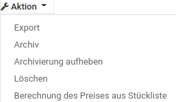
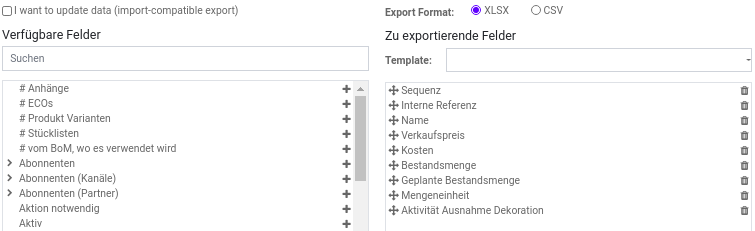

# Datenmanagement

## Daten exportieren
In den verschiedenen Apps besteht immer die Möglichkeit Daten zu exportieren. Folgende Abbildung zeigt das Beispiel in der Maske Fertigung > Stammdaten > Produkte.

::: tip
Damit die Auswahl *Aktion* erscheint, müssen die Daten in der Listenansicht angezeigt werden.
:::

Wählen Sie die Aktion *Export*. Anschliessend erscheint die Maske zur Definition der zu exportierenden Felder.

::: tip
Die zu exportierenden Felder müssen für jeden Zweck sorgfältig ausgewählt werden. Beachten Sie hierzu die Angaben im Abschnitt Datenstruktur Export.
:::

## Daten importieren
In den verschiedenen Apps besteht immer die Möglichkeit Daten zu importieren. Folgende Abbildung zeigt das Beispiel in der Maske Fertigung > Stammdaten > Produkte.

Drücken sie den Knopf *Import*. Anschliessend erscheint folgende Maske mit der Möglichkeit eine Datei für den Import auszuwählen.

::: tip
Die Struktur der zu importierenden Datei muss für jeden Zweck bestimmte Vorgaben erfüllen.
:::

Mit der Funktion *Testbetrieb* wird festgestellt, ob die Stuktur der Datei den Vorgaben entspricht. Folgende Meldung bestätigt, dass der Import erfolgsversprechend ist.

Nun können sie mit dem Knopf *Import* den Datentransfer ausführen.

## Daten aktualisieren

Den Entwicklermodus aktivieren.  
Einen Datenexport starten.  
Die Checkbox *I want to update data (import-compatible export)* markieren.

::: tip
Mit der Funktion *I want to update data* wird erreicht, dass die in der Datenbank vorhandenen Einträge überschrieben werden.
:::

## Demodaten anzeigen

Auf GitHub veröffentlicht die Mint System [Odoo-Demodaten](////////https://github.com/mint-system/odoo-demodaten.html.html.html.html.html.html.html.html). Hier finden sie Importbereite Datensätze für die Odoo-Module.

[📝 Edit on GitHub](///////https://github.com/mint-system/odoo-handbuch/blob/master/datenmanagement.html.html.html.html.html.html.html)

<footer>Copyright © <a href="https://www.mint-system.ch/">Mint System GmbH</a></footer>

[📝 Edit on GitHub](//////https://github.com/mint-system/odoo-handbuch/blob/master/datenmanagement.html.html.html.html.html.html)

<footer>Copyright © <a href="https://www.mint-system.ch/">Mint System GmbH</a></footer>

[📝 Edit on GitHub](/////https://github.com/mint-system/odoo-handbuch/blob/master/datenmanagement.html.html.html.html.html)

<footer>Copyright © <a href="https://www.mint-system.ch/">Mint System GmbH</a></footer>

[📝 Edit on GitHub](////https://github.com/mint-system/odoo-handbuch/blob/master/datenmanagement.html.html.html.html)

<footer>Copyright © <a href="https://www.mint-system.ch/">Mint System GmbH</a></footer>

[📝 Edit on GitHub](///https://github.com/mint-system/odoo-handbuch/blob/master/datenmanagement.html.html.html)

<footer>Copyright © <a href="https://www.mint-system.ch/">Mint System GmbH</a></footer>

[📝 Edit on GitHub](//https://github.com/mint-system/odoo-handbuch/blob/master/datenmanagement.html.html)

<footer>Copyright © <a href="https://www.mint-system.ch/">Mint System GmbH</a></footer>

[📝 Edit on GitHub](/https://github.com/mint-system/odoo-handbuch/blob/master/datenmanagement.html)

<footer>Copyright © <a href="https://www.mint-system.ch/">Mint System GmbH</a></footer>

[📝 Edit on GitHub](https://github.com/Mint-System/Odoo-Handbuch/blob/master/datenmanagement.md)

<footer>Copyright © <a href="https://www.mint-system.ch/">Mint System GmbH</a></footer>