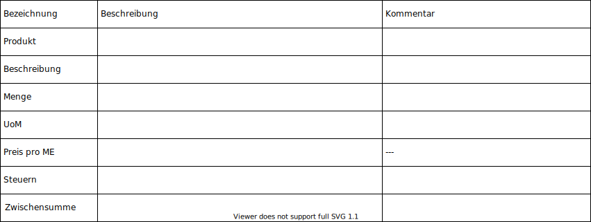

# Einkauf

## Angebotsanfrage erstellen

Über *Anlegen* wird eine Angebotsanfrage eröffnet. Die Felder der Eingabemaske sind gemäss folgender Tabelle zu editieren:

**Produkte einfügen**

Im Register Produkte werden die gewünschten Artikel gelistet. Folgende Felder stehen zur Verfügung:

## Angebotsanfrage senden

Mit dem Knopf *Per E-Mail Versenden* wird eine PDF-Datei generiert und per eMail an den Lieferanten gesendet.

## Portal-Ansicht Bestellung anzeigen

Die Portal-Ansicht einer Bestellung können sie wie folgt anzeigen:
* Öffnen Angebotsanfrage
* Ausführen *Aktion > Teilen > Text kopieren*
* Neues privates Browser-Fenster öffnen
* Link in Adressleiste einfügen

::: tip
In einem privaten Browser werden die Cookies nicht geladen und somit wird man nicht automatisch bei Odoo angemeldet.
:::

[📝 Edit on GitHub](///////https://github.com/mint-system/odoo-handbuch/blob/master/einkauf.html.html.html.html.html.html.html)

<footer>Copyright © <a href="https://www.mint-system.ch/">Mint System GmbH</a></footer>

[📝 Edit on GitHub](//////https://github.com/mint-system/odoo-handbuch/blob/master/einkauf.html.html.html.html.html.html)

<footer>Copyright © <a href="https://www.mint-system.ch/">Mint System GmbH</a></footer>

[📝 Edit on GitHub](/////https://github.com/mint-system/odoo-handbuch/blob/master/einkauf.html.html.html.html.html)

<footer>Copyright © <a href="https://www.mint-system.ch/">Mint System GmbH</a></footer>

[📝 Edit on GitHub](////https://github.com/mint-system/odoo-handbuch/blob/master/einkauf.html.html.html.html)

<footer>Copyright © <a href="https://www.mint-system.ch/">Mint System GmbH</a></footer>

[📝 Edit on GitHub](///https://github.com/mint-system/odoo-handbuch/blob/master/einkauf.html.html.html)

<footer>Copyright © <a href="https://www.mint-system.ch/">Mint System GmbH</a></footer>

[📝 Edit on GitHub](//https://github.com/mint-system/odoo-handbuch/blob/master/einkauf.html.html)

<footer>Copyright © <a href="https://www.mint-system.ch/">Mint System GmbH</a></footer>

[📝 Edit on GitHub](/https://github.com/mint-system/odoo-handbuch/blob/master/einkauf.html)

<footer>Copyright © <a href="https://www.mint-system.ch/">Mint System GmbH</a></footer>

[📝 Edit on GitHub](https://github.com/Mint-System/Odoo-Handbuch/blob/master/einkauf.md)

<footer>Copyright © <a href="https://www.mint-system.ch/">Mint System GmbH</a></footer>