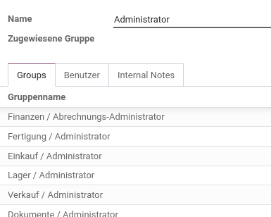

# Einstellungen

## Bereiche
- [Einstellungen-Übersetzung](////////einstellungen-übersetzung.html.html.html.html.html.html.html.html)

## Entwicklermodus aktivieren

Navigieren nach *Einstellungen > Allgemeine Einstellungen > Entwickler Tools*.

Auf *Entwicklermodus aktivieren* klicken. Nun erscheinen neue Optionen in verschiedenen Odoo Apps. In der URL erscheint zusätzlich der Parameter `?debug=1`. Der Entwicklermodus kann auch über die manuelle Eingabe dieses Parameters aktiviert werden.

## Tour deaktivieren

Aktivieren Sie den [Entwicklermodus](////////einstellungen.html.html.html.html.html.html.html.html#entwicklermodus-aktivieren).

Klicken sie auf das Käfer-Symbol in der Menu-Leiste oben rechts. Wählen sie *Tour deaktivieren*.

## Benutzerrechte vergeben
Aufgabenträger: [Administrator](////////rollen.html.html.html.html.html.html.html.html#administrator)

Navigieren sie nach *Einstellungen > Allgemeine Einstellungen > Benutzer* und klicken auf *Benutzer verwalten*. Wählen sie den Benutzer, dessen Zugriffsrechte sie verändern möchten. Drücken sie auf *Bearbeiten* und wählen sie nun über die Dropdown oder Checkboxen die Rollen und Zugriffe aus.

Klicken Sie auf speichern um den Vorgang abzuschliessen.

!> Damit die neuen Rechte für den Benutzer sichtbar sind, muss dieser den Browser aktualisieren.

## Passwort zurücksetzen
Aufgabenträger: [Administrator](////////rollen.html.html.html.html.html.html.html.html#administrator)

Navigieren sie nach *Einstellungen > Allgemeine Einstellungen > Benutzer* und klicken auf *Benutzer verwalten*. Wählen sie den Benutzer, dessen Passwort sie zurücksetzen möchten.
 
Wählen Sie *Aktion* und *Passwort ändern*. Geben sie im Feld *Neues Passwort* das neue Passwort ein.

## Kundenregistration erlauben

Damit Besucher der Website sich im Odoo-Portal registrieren könne muss die Option *Einstellungen > Allgemeine Einstellungen > Berechtigungen > Kundenkontro > Kostenlose Anmeldung* aktiviert sein.

## Dokumentlayout konfigurieren

Die Darstellung der generierten Dokumente kann einfach angepasst werden. Navigieren sie nach *Einstellungen > Allgemeine Einstellungen > Geschäftsunterlagen* und wählen sie *Dokumentlayout konfigurieren* aus. Die hier ausgewählte Dokumentvorlage wird für alle Berichte übernommen.

## Rollen erstellen

::: warning
Diese Anleitung erfordert das Modul `base_user_role`.
:::

Die Gruppenrechte können mit Benutzerrollen zusammengefasst werden. Mit der entsprechenden Erweiterung kann man Rollen erstellen, Gruppen hinzufügen und diese für einen Benutzer aktivieren.

Navigieren sie nach *Einstellungen > Benutzer und Unternehmen > Roles* und wählen sie *Anlegen*. Erstellen zur Initieirung eine Administratoren-Rolle mit diesen Angaben:

Weisen sie im Tab *Benutzer* die Rolle einem Benutzer zu. Ist die Rolle aktiv, überschreibt sie die existierenden Berechtigungen.

## Papieformat für Bericht anpassen

#FIXME
  
Angenommen

Papierformat "European A4 without borders" duplizieren und als "A4 for isr report".  

Paierformat anpassen -> Linker Rand (mm)5.00  

Im Entwicklermodus nach Berichte suchen -> ISR auswählen und Papieformat festlegen.

[📝 Edit on GitHub](///////https://github.com/mint-system/odoo-handbuch/blob/master/einstellungen.html.html.html.html.html.html.html)

<footer>Copyright © <a href="https://www.mint-system.ch/">Mint System GmbH</a></footer>

[📝 Edit on GitHub](//////https://github.com/mint-system/odoo-handbuch/blob/master/einstellungen.html.html.html.html.html.html)

<footer>Copyright © <a href="https://www.mint-system.ch/">Mint System GmbH</a></footer>

[📝 Edit on GitHub](/////https://github.com/mint-system/odoo-handbuch/blob/master/einstellungen.html.html.html.html.html)

<footer>Copyright © <a href="https://www.mint-system.ch/">Mint System GmbH</a></footer>

[📝 Edit on GitHub](////https://github.com/mint-system/odoo-handbuch/blob/master/einstellungen.html.html.html.html)

<footer>Copyright © <a href="https://www.mint-system.ch/">Mint System GmbH</a></footer>

[📝 Edit on GitHub](///https://github.com/mint-system/odoo-handbuch/blob/master/einstellungen.html.html.html)

<footer>Copyright © <a href="https://www.mint-system.ch/">Mint System GmbH</a></footer>

[📝 Edit on GitHub](//https://github.com/mint-system/odoo-handbuch/blob/master/einstellungen.html.html)

<footer>Copyright © <a href="https://www.mint-system.ch/">Mint System GmbH</a></footer>

[📝 Edit on GitHub](/https://github.com/mint-system/odoo-handbuch/blob/master/einstellungen.html)

<footer>Copyright © <a href="https://www.mint-system.ch/">Mint System GmbH</a></footer>

[📝 Edit on GitHub](https://github.com/Mint-System/Odoo-Handbuch/blob/master/einstellungen.md)

<footer>Copyright © <a href="https://www.mint-system.ch/">Mint System GmbH</a></footer>