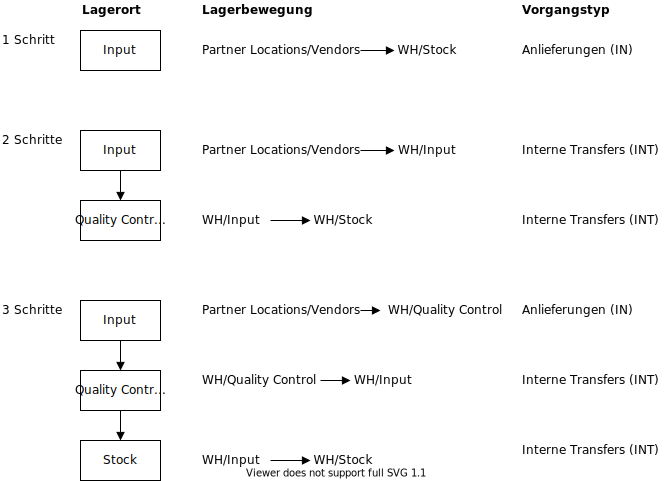

# Lager

## Lager anlegen
In den Grundeinstellungen ist ein Lager mit dem Namen der Firma, dem Kürzel *WH* und der Adresse der Firma angelegt.

Beispiel:

### Routen
Über die Auswahl der Funktionen pro Lager wird bestimmt, welche Routen verfügbar sein. Die vorhandenen Routen sind über einen Smartbutton oben rechts erreichbar.

#### Reihenfolge
Die Reihenfolge der Routen und damit die Priorisierung wird über die Liste in der Darstellung Lager > Konfiguration > Routen definiert.

Die entsprechende Darstellung im Tab *Lager* in der Produktansicht zeigt sich wie folgt:

Die Sichtbarkeit der Routen in den verschiedenen Darstellungen wird über die Option *Auswahlmöglichkeit* für jede Route eingestellt.

#### Vordefinierte Routen
Für den Empfang und die Lieferung von Produkten sind Routen für die Varianten 1, 2 oder 3 Schritte vordefiniert. Über die Auswahl in der Ansicht Lager > Lager Konfiguration werden die Routen automatisch eingerichtet.

##### Empfangsschritte

Zur Auswahl stehen folgende drei Varianten:
1.  Produkte direkt anliefern (1 Schritt)
2. Receive goods in input and then stock (2 steps)
3. Receive goods in input, then quality and then stock (3 steps)

##### Lieferungsschritte

Zur Auswahl stehen:
1. Güter direkt anliefern (1 Schritt)
2. Send goods in output and then deliver (2 steps)
3. Ware verpacken, Ware in die Ausgabe schicken und dann ausliefern (3 Schritte)

### Strategien

Mit Odoo 14 wurde die Funktionalität "Replenishment" ausgebaut. *Replenish on Order (MTO)* soll damit an Bedeutung verlieren.

### Regeln

Es besteht folgender Zusammenhang zwischen Lager, Routen und Regeln:

#### Propagation

::: tip
Über die Einstellung *Weitergabe Beschaffungsgruppe* wird programmiert ob Bestellvorschläge kummuliert werden oder ob separate Angebotsanfragen erstellt werden.
:::

## Lagerorte

## Vorgangstypen
Standardmässig sind folgende Vorgangstypen eingerichtet:
1. Anlieferungen
2. Lieferaufträge
3. Manufacturing

Die Vorgangstypen erscheinen in der Lagerübersicht

Einstellungen:

## Erweiterte Vorgangstypen I
Wenn in den Einstellungen für das Lager die Option *Mehrstufige Routen* eingeschaltet wird, erweitert sich die Liste der Vorgangstypen mit *Interne Transfers*. Die neue Liste zeigt sich wie folgt:

1. Anlieferungen
2. Interne Transfers
3. Lieferaufträge
4. Manufacturing

Die Option "Mehrere Lagerorte" wird automatisch eingeschaltet und es erscheinen im Menu die neuen Funktion *Lagerorte* und *Regeln*.

## Erweiterte Vorgangstypen II
Wenn für die Lieferungsschritte die Variante *3 Schritte* (siehe oben) gewählt wird, werden die Vorgangstypen mit *Pick* und *Pack* erweitert. Die neue Liste zeigt sich wie folgt:

1. Anlieferungen
2. Interne Transfers
3. Pick
4. Pack
5. Lieferaufträge
6. Manufacturing

## Inventur
### Inventur vorbereiten
Navigieren sie zum Menu Vorgänge > Inventur. Mit dem Knopf ANLEGEN erstellen sie einen Inventurauftrag. Befüllen sie die Felder gemäss untenstehender Tabelle.

### Inventur durchführen

Starten sie die vorbereitete Inventur mit INVENTUR STARTEN.

Falls ein nicht gelistetes Produkt gezählt wird, kann über ANLEGEN eine neue Position eingefügt werden.

Befüllen sie nun die Spalte *Gezählt* entsprechend der gezählten Quantität pro Produkt. Nach der abgeschlossenen Zählung wird mit BESTANDSBUCHUNG DURCHFÜHREN der korrigierte Bestand gebucht. Das Protokoll kann über PRINT COUNT SHEET erstellt werden.

## Scheduler
Der Scheduler ist die Rechenmaschine welche die Produktion und den Einkauf plant und priorisiert. Er tut dies automatisch basierend auf den Regeln die pro Produkt definiert sind. Standardmässig läuft der scheduler jede Nacht um 24:00 Uhr.

Der Scheduler prüft nur Beschaffungen die bestätigt, aber noch nicht begonnen wurden.

Diese vorbereiteten Beschaffungen werden je nach Konfiguration des betroffenen Produkts die Produktion, Aufgaben oder Einkäufe selbst starten.

Der Scheduler berücksichtigt beim Starten von Reservierungen und Beschaffungen die Priorität der Vorgänge. Dringende Anfragen werden zuerst gestartet.

::: tip
Falls nicht genügend Produkte auf Lager sind um alle Anfragen zu erfüllen, werden die dringendsten zuerst produziert.
:::

## Priorisierung
::: tip
Durch Aktivierung des Sterns im Objekt der Auslieferung wird der Auftrag priorisiert.
:::

[📝 Edit on GitHub](///////https://github.com/mint-system/odoo-handbuch/blob/master/lager.html.html.html.html.html.html.html)

<footer>Copyright © <a href="https://www.mint-system.ch/">Mint System GmbH</a></footer>

[📝 Edit on GitHub](//////https://github.com/mint-system/odoo-handbuch/blob/master/lager.html.html.html.html.html.html)

<footer>Copyright © <a href="https://www.mint-system.ch/">Mint System GmbH</a></footer>

[📝 Edit on GitHub](/////https://github.com/mint-system/odoo-handbuch/blob/master/lager.html.html.html.html.html)

<footer>Copyright © <a href="https://www.mint-system.ch/">Mint System GmbH</a></footer>

[📝 Edit on GitHub](////https://github.com/mint-system/odoo-handbuch/blob/master/lager.html.html.html.html)

<footer>Copyright © <a href="https://www.mint-system.ch/">Mint System GmbH</a></footer>

[📝 Edit on GitHub](///https://github.com/mint-system/odoo-handbuch/blob/master/lager.html.html.html)

<footer>Copyright © <a href="https://www.mint-system.ch/">Mint System GmbH</a></footer>

[📝 Edit on GitHub](//https://github.com/mint-system/odoo-handbuch/blob/master/lager.html.html)

<footer>Copyright © <a href="https://www.mint-system.ch/">Mint System GmbH</a></footer>

[📝 Edit on GitHub](/https://github.com/mint-system/odoo-handbuch/blob/master/lager.html)

<footer>Copyright © <a href="https://www.mint-system.ch/">Mint System GmbH</a></footer>

[📝 Edit on GitHub](https://github.com/Mint-System/Odoo-Handbuch/blob/master/lager.md)

<footer>Copyright © <a href="https://www.mint-system.ch/">Mint System GmbH</a></footer>