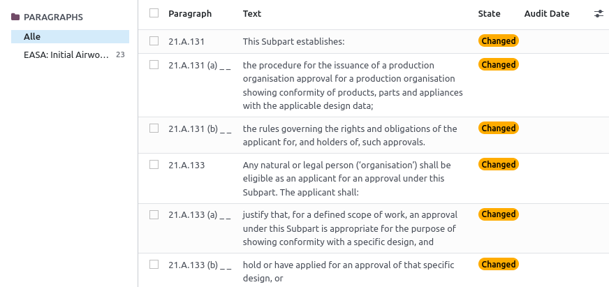
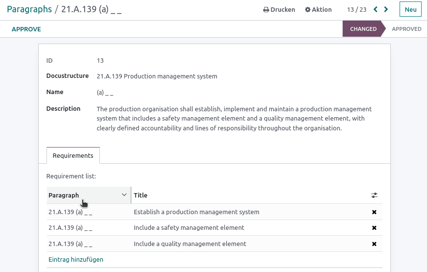
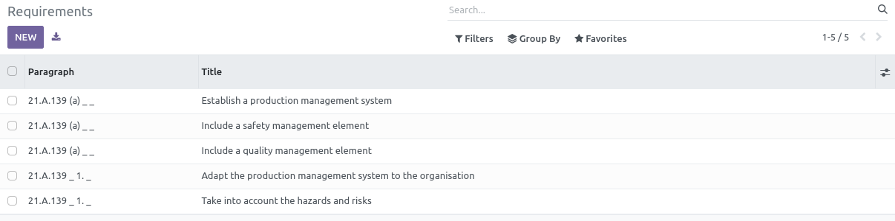
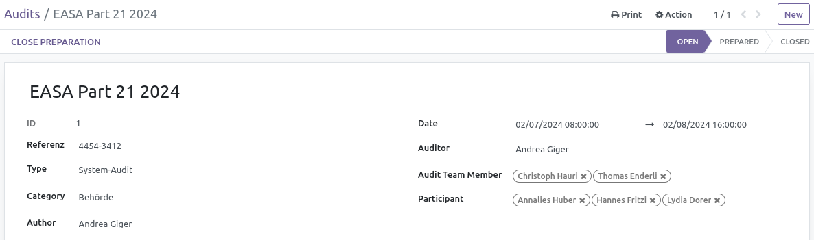
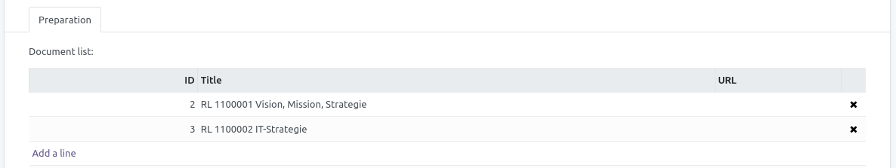
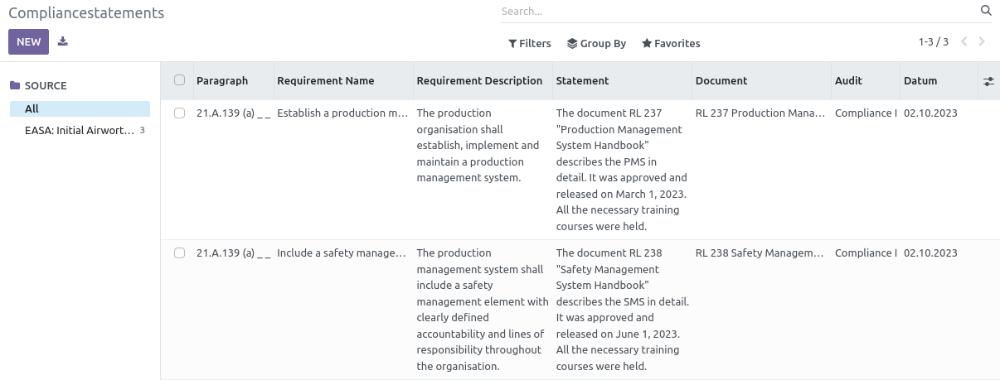

# Mgmt

{{ $frontmatter.description }}

Technischer Name: `mgmt`\
Repository: <https://github.com/Mint-System/Odoo-Apps-Management/tree/16.0/mgmt>

::: warning
Diese App ist veraltet. Wir empfehlen die App [Mgmt Base](Mgmt%20Base.md) zu verwenden.
#DEPRECATED
:::

## Stammdaten

### Paragraphs erfassen

Regulatorien werden in der Struktur ihrer Kapitel und Paragraphen in der Datenbank erfasst. (Bestimmte Dokumente wie zum Beispiel EASA Part 21 und 145 für die Luftfahrt oder EN 9001 für das Qualitätsmanagement können als Tabellen für den Import von der Mint System GmbH zur Verfügung gestellt werden.)
Dadurch hat jeder Abschnitt eine eindeutige Identifizierung.

### Requirements erfassen

Alle Paragraphen werden in Requirements abgebildet. Mit der Funktion *Approve* wird mit einem Statement die Vollständigkeit bestätigt.

Alle Requirements erscheinen in einer übersichtlichen Liste.

## Audit

### Audit erfassen

Mittels Audits werden Compliancestatement zu den Requirements erstellt.
Zunächst wird ein Audit geplant indem Stammdaten erfasst werden.

### Audit vorbereiten

## Compliance Statements

### Statement erfassen

