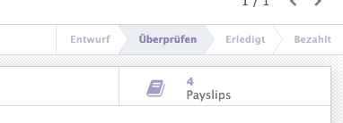

# Personalabrechnung

## Pesonalabrechnung initialisieren

Damit sie die Personalabrechnung für ihre Mitarbeiter erstellen können, müssen einige vorbereitungen getroffen werden.

Dazu eine Übersicht:
* [Mitarbeiter erfassen](////////personal.html.html.html.html.html.html.html.html#personal#mitarbeiter-erfassen)
* [Private Adresse hinterlegen](////////personal.html.html.html.html.html.html.html.html#private-adresse-hinterlegen)
* [Arbeitsvertrag hinzufügen](////////personal.html.html.html.html.html.html.html.html#arbeitsvertrag-hinzufugen)
* [Bankverbindung hinterlegen](////////personalabrechnung.html.html.html.html.html.html.html.html#bankverbindung-hinterlegen)
* [Anteile Arbeitgeber / Arbeitnehmer konfigurieren](////////personalabrechnung.html.html.html.html.html.html.html.html#anteile-arbeitgeber-arbeitnehmer-konfigurieren)
* [Lohnarten definieren](////////personalabrechnung.html.html.html.html.html.html.html.html#lohnarten-definieren)
* [Finanzkonten den Lohnarten zuweisen](////////personalabrechnung.html.html.html.html.html.html.html.html#finanzkonten-den-lohnarten-zuweisen)
* [Gehaltsinformationen eingeben](////////personalabrechnung.html.html.html.html.html.html.html.html#gehaltsinformationen-eingeben)

Konfigurieren sie diese Punkte, erst dann können sie die [Lohnabrechnung erstellen](////////personalabrechnung.html.html.html.html.html.html.html.html#lohnabrechnung-erstellen).

## Bankverbindung hinterlegen

Zur Auszahlung des Lohns über SEPA müssen sie den Mitarbeiter ein Bankkonto hinterlegen. Navigieren sie nach *Pesonal > Mitarbeiter auswählen > Bearbeiten > Tab Private Information* und erfassen sie ein Bankkonto unter *Bankverbindung*.

## Anteile Arbeitgeber / Arbeitnehmer konfigurieren

Die Anteile des Arbeitgebener und Arbeitnehmer können als Vorlage erfasst werden. Die Anteile werde werden dem Arbeitsvertrag zugewiesen.

Möchten sie eine neue Vorlage erstellen, öffnen sie *Personalabrechnung > Konfiguration > Anteile Arbeitgeber / Arbeitnehmer* und wählen *Anlegen.*

Geben sie einen Namen mit Jahresdatum ein und legen sie die Fix- und Prozentwerte fest.

## Lohnarten definieren

::: tip
Das sind die Regeln, die Informationen über die Gehaltsberechnung liefern. Diese Regeln werden von odoo gemäss der Reihenfolge ihrer Sequenznummer interpretiert. Die Regeln können verwendet werden, um Buchungen zu erzeugen, ohne dass diese in der Gehaltsliste sichtbar sind.
:::

Die Lohnregel sind unter *Personalabrechnung > Konfiguration > Regeln* definiert. Überprüfen sie alle Regeln und legen sie fest welche auf dem Lohnzettel erscheinen sollen.

Regeln für die sie keine Verwendung haben, können sie archivieren.

## Finanzkonten den Lohnarten zuweisen

Damit  die Lohnabrechnung auch in der Finanzbuchhaltung ersichtlich ist, müssen sie für alle Lohnregeln die entsprechenden Soll- und Habenkonten hinterlegen. Eine Übersicht dazu finden sie unter [Best-Practice Lohnbuchhaltung](////////best-practice-lohnbuchhaltung.html.html.html.html.html.html.html.html).

Navigieren sie nach *Personalabrechnung > Konfiguration > Regeln > Regel auswählen > Beareiten > Tab Finanzen* und weisen sie dort die Konten zu.

## Lohnabrechnung erstellen

Lohnabrechnung können für mehre oder einzelne Mitarbeiter ausgeführt werden.

**Einzeln**

Um eine einzelne Lohnabrechnung zu erzeugen wählen sie den Mitarbeiter aus *Personal > Mitarbeiter auswählen* und klicken auf den Link *Abrechnungen Mitarbeiterverfügung* und wählen *Anlegen*. Legen sie die Zeitperiode fest, speichern sie den Eintrag und drücken *Berechnen*. Nun wird die Lohnabrechnung erstellt und ist bereit zur Verbuchung.

**Batch**

Navigieren sie nach *Personalabrechnung > Work Entries > Work Entries* und wählen den aktuellen Monat. Starten sie den Batch-Vorgang mit *Lohnabrechnung erzeugen*. Für jeden Mitarbeiter wird nun eine Lohnabrechnung erzeugt und steht bereit zur Prüfung.

Mit *Create draft entry* werden die einzelnen Lohnabrechnungen berechnet und eine Buchung vorbereitet.

## Lohnabrechnung verbuchen

Wählen sie eine aktuelle Lohnabrechnung, die im Status *Erledigt* ist: *Personalabrechnung > Abrechnung Mitarbeitervergütung > All Payslips > Payslip auswählen*. Öffnen sie den Tab *Finanzen* und klicken auf den Link unter *Buchung*.

Hier werden alle Buchungen der Lohnabrechnung aufgeführt.

::: warning
Werden die Lohnzahlung als Batch verarbeitet, müssen alle Lohnabrechnungen bestätigt sein, damit eine Zahlung ausgelöst werden kann.
:::

## Gehaltsinformationen eingeben

Die Gehaltsinformationen der Mitarbeiter legen sie via *Pesonal > Mitarbeiter auswählen > Link Verträge > Arbeitsvertrag auswählen > Bearbeiten > Tab Gehaltsinformationen* fest.

[📝 Edit on GitHub](///////https://github.com/mint-system/odoo-handbuch/blob/master/personalabrechnung.html.html.html.html.html.html.html)

<footer>Copyright © <a href="https://www.mint-system.ch/">Mint System GmbH</a></footer>

[📝 Edit on GitHub](//////https://github.com/mint-system/odoo-handbuch/blob/master/personalabrechnung.html.html.html.html.html.html)

<footer>Copyright © <a href="https://www.mint-system.ch/">Mint System GmbH</a></footer>

[📝 Edit on GitHub](/////https://github.com/mint-system/odoo-handbuch/blob/master/personalabrechnung.html.html.html.html.html)

<footer>Copyright © <a href="https://www.mint-system.ch/">Mint System GmbH</a></footer>

[📝 Edit on GitHub](////https://github.com/mint-system/odoo-handbuch/blob/master/personalabrechnung.html.html.html.html)

<footer>Copyright © <a href="https://www.mint-system.ch/">Mint System GmbH</a></footer>

[📝 Edit on GitHub](///https://github.com/mint-system/odoo-handbuch/blob/master/personalabrechnung.html.html.html)

<footer>Copyright © <a href="https://www.mint-system.ch/">Mint System GmbH</a></footer>

[📝 Edit on GitHub](//https://github.com/mint-system/odoo-handbuch/blob/master/personalabrechnung.html.html)

<footer>Copyright © <a href="https://www.mint-system.ch/">Mint System GmbH</a></footer>

[📝 Edit on GitHub](/https://github.com/mint-system/odoo-handbuch/blob/master/personalabrechnung.html)

<footer>Copyright © <a href="https://www.mint-system.ch/">Mint System GmbH</a></footer>

[📝 Edit on GitHub](https://github.com/Mint-System/Odoo-Handbuch/blob/master/personalabrechnung.md)

<footer>Copyright © <a href="https://www.mint-system.ch/">Mint System GmbH</a></footer>