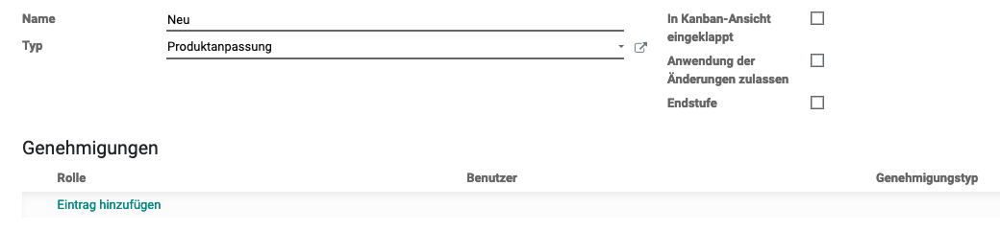

# PLM

## Begriffe

ECO: Engineering Change Order

## ECO-Typ und Stufen erfassen

Um einen ECO-Type zu erfassen navigieren sie nach *PLM > Konfiguration > ECO-Typen*. Mit einem klick auf *+ Anlegen* erstellen sie einen neuen Typen.

Damit die Prozess-Stufen beim Auswahl des Types dargestellt wird, navigieren sie nach *Konfiguration > ECO-Stufen* und klicken auf *+ Anlegen*.

Wählen sie den Typen aus und legen die Optionen fest.

* Anwendung der Änderungen zulassen: Die Änderungen darf aktiviert werden.
* Endstufe: Die Änderung ist abgeschlossen.
* Genehmigung: Odoo-Benutzer festlegen, der die Änderungen auf der Stufe genehmigen muss.

## Technischer Änderungsauftrag erfassen

Klicken sie auf *PLM > Änderungen > + Anlegen*.

Wählen Sie *Neue Revision starten*.

[📝 Edit on GitHub](///////https://github.com/mint-system/odoo-handbuch/blob/master/plm.html.html.html.html.html.html.html)

<footer>Copyright © <a href="https://www.mint-system.ch/">Mint System GmbH</a></footer>

[📝 Edit on GitHub](//////https://github.com/mint-system/odoo-handbuch/blob/master/plm.html.html.html.html.html.html)

<footer>Copyright © <a href="https://www.mint-system.ch/">Mint System GmbH</a></footer>

[📝 Edit on GitHub](/////https://github.com/mint-system/odoo-handbuch/blob/master/plm.html.html.html.html.html)

<footer>Copyright © <a href="https://www.mint-system.ch/">Mint System GmbH</a></footer>

[📝 Edit on GitHub](////https://github.com/mint-system/odoo-handbuch/blob/master/plm.html.html.html.html)

<footer>Copyright © <a href="https://www.mint-system.ch/">Mint System GmbH</a></footer>

[📝 Edit on GitHub](///https://github.com/mint-system/odoo-handbuch/blob/master/plm.html.html.html)

<footer>Copyright © <a href="https://www.mint-system.ch/">Mint System GmbH</a></footer>

[📝 Edit on GitHub](//https://github.com/mint-system/odoo-handbuch/blob/master/plm.html.html)

<footer>Copyright © <a href="https://www.mint-system.ch/">Mint System GmbH</a></footer>

[📝 Edit on GitHub](/https://github.com/mint-system/odoo-handbuch/blob/master/plm.html)

<footer>Copyright © <a href="https://www.mint-system.ch/">Mint System GmbH</a></footer>

[📝 Edit on GitHub](https://github.com/Mint-System/Odoo-Handbuch/blob/master/plm.md)

<footer>Copyright © <a href="https://www.mint-system.ch/">Mint System GmbH</a></footer>