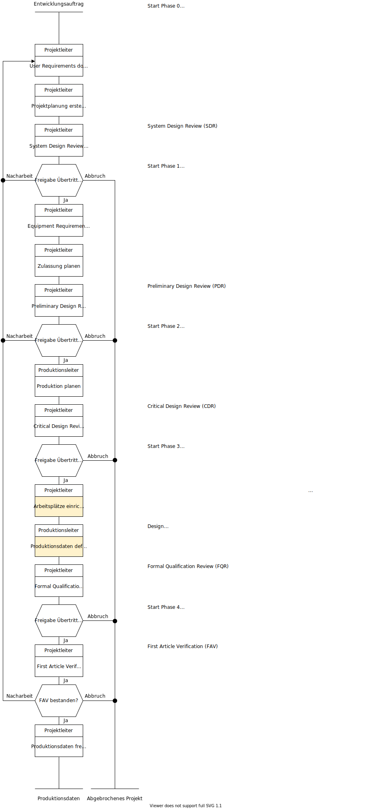

# Prozess Entwicklung

- [Arbeitsplätze einrichten](////////tmp/kurt-gisler/arbeitsplätze-einrichten.html.html.html.html.html.html.html.html)
- [Produktionsdaten definieren](////////tmp/kurt-gisler/produktionsdaten-definieren.html.html.html.html.html.html.html.html)

[📝 Edit on GitHub](///////https://github.com/mint-system/odoo-handbuch/blob/master/prozess-entwicklung.html.html.html.html.html.html.html)

<footer>Copyright © <a href="https://www.mint-system.ch/">Mint System GmbH</a></footer>

[📝 Edit on GitHub](//////https://github.com/mint-system/odoo-handbuch/blob/master/prozess-entwicklung.html.html.html.html.html.html)

<footer>Copyright © <a href="https://www.mint-system.ch/">Mint System GmbH</a></footer>

[📝 Edit on GitHub](/////https://github.com/mint-system/odoo-handbuch/blob/master/prozess-entwicklung.html.html.html.html.html)

<footer>Copyright © <a href="https://www.mint-system.ch/">Mint System GmbH</a></footer>

[📝 Edit on GitHub](////https://github.com/mint-system/odoo-handbuch/blob/master/prozess-entwicklung.html.html.html.html)

<footer>Copyright © <a href="https://www.mint-system.ch/">Mint System GmbH</a></footer>

[📝 Edit on GitHub](///https://github.com/mint-system/odoo-handbuch/blob/master/prozess-entwicklung.html.html.html)

<footer>Copyright © <a href="https://www.mint-system.ch/">Mint System GmbH</a></footer>

[📝 Edit on GitHub](//https://github.com/mint-system/odoo-handbuch/blob/master/prozess-entwicklung.html.html)

<footer>Copyright © <a href="https://www.mint-system.ch/">Mint System GmbH</a></footer>

[📝 Edit on GitHub](/https://github.com/mint-system/odoo-handbuch/blob/master/prozess-entwicklung.html)

<footer>Copyright © <a href="https://www.mint-system.ch/">Mint System GmbH</a></footer>

[📝 Edit on GitHub](https://github.com/Mint-System/Odoo-Handbuch/blob/master/prozess-entwicklung.md)

<footer>Copyright © <a href="https://www.mint-system.ch/">Mint System GmbH</a></footer>