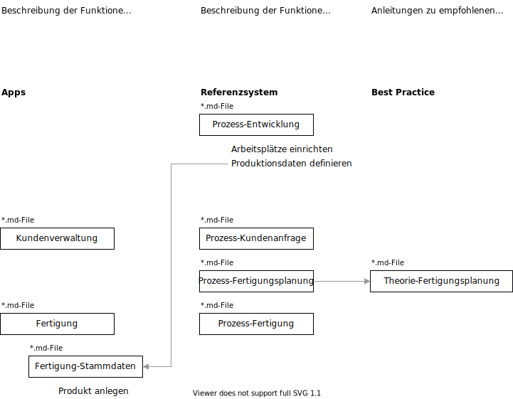

# Odoo Handbuch

Das Odoo Handbuch beschreibt die Funktionen von Odoo aus den drei Perspekten Apps, Referenzsystem und Best Practice.

[Referenzsystem](////////referenzsystem.html.html.html.html.html.html.html.html)  
[Best-Practice](////////best-practice.html.html.html.html.html.html.html.html)

# Apps

  
[Installation](////////installation.html.html.html.html.html.html.html.html)

  
[Initialisierung](////////initialisierung.html.html.html.html.html.html.html.html)

  
[Navigation](////////navigation.html.html.html.html.html.html.html.html)

  
[Persönliche Einstellungen](////////pers%c3%b6nliche-einstellungen.html.html.html.html.html.html.html.html)

  
[Apps](////////apps.html.html.html.html.html.html.html.html)

  
[Einstellungen](////////einstellungen.html.html.html.html.html.html.html.html)

  
[Diskussion](////////diskussion.html.html.html.html.html.html.html.html)

  
[Kalender](////////kalender.html.html.html.html.html.html.html.html)

  
[Kontakte](////////kontakte.html.html.html.html.html.html.html.html)

  
[Notizen](////////notizen.html.html.html.html.html.html.html.html)

  
[Dashboards](////////dashboards.html.html.html.html.html.html.html.html)

  
[Kundenverwaltung](////////kundenverwaltung.html.html.html.html.html.html.html.html)

  
[Verkäufe](////////verkäufe.html.html.html.html.html.html.html.html)

  
[Einkauf](////////einkauf.html.html.html.html.html.html.html.html)

  
[Fertigung](////////fertigung.html.html.html.html.html.html.html.html)

  
[PLM](////////plm.html.html.html.html.html.html.html.html)

  
[Projekt](////////projekt.html.html.html.html.html.html.html.html)

  
[Finanzen](////////finanzen.html.html.html.html.html.html.html.html)

  
[Zeiterfassung](////////zeiterfassung.html.html.html.html.html.html.html.html)

  
[Personal](////////personal.html.html.html.html.html.html.html.html)

  
[Personalabrechnung](////////personalabrechnung.html.html.html.html.html.html.html.html)

  
[Abwesenheitszeiten](////////abwesenheitszeiten.html.html.html.html.html.html.html.html)

  
[Anwesenheitszeiten](////////anwesenheitszeiten.html.html.html.html.html.html.html.html)

  
[Link Tracker](////////link-tracker.html.html.html.html.html.html.html.html)

  
[Odoo App](////////odoo-app.html.html.html.html.html.html.html.html)

  
[Lager](////////lager.html.html.html.html.html.html.html.html)

  
[Strichode](////////strichcode.html.html.html.html.html.html.html.html)

  
[Fleet](////////fleet.html.html.html.html.html.html.html.html)

  
[Website](////////website.html.html.html.html.html.html.html.html)

  
[ioT](////////iot.html.html.html.html.html.html.html.html)

  
[Studio](////////studio.html.html.html.html.html.html.html.html)

  
[Entwicklung](////////entwicklung.html.html.html.html.html.html.html.html)

  
[Datenmanagement](////////datenmanagement.html.html.html.html.html.html.html.html)

  
[Update](////////update.html.html.html.html.html.html.html.html)

  
[Datenbankmanager](////////datenbankmanager.html.html.html.html.html.html.html.html)

  
[Troubleshooting](////////troubleshooting.html.html.html.html.html.html.html.html)

## Mitarbeit

Sie können eine Kopie des Handbuchs erstellen und für eigene Zwecke nutzen. Ebenfalls können sie Änderungen mitteilen und mit dem offizielen Handbuch zusammenführen. Mehr dazu unter [Mitarbeit](////////mitarbeit.html.html.html.html.html.html.html.html).

[📝 Edit on GitHub](///////https://github.com/mint-system/odoo-handbuch/blob/master/readme.html.html.html.html.html.html.html)

<footer>Copyright © <a href="https://www.mint-system.ch/">Mint System GmbH</a></footer>

[📝 Edit on GitHub](//////https://github.com/mint-system/odoo-handbuch/blob/master/readme.html.html.html.html.html.html)

<footer>Copyright © <a href="https://www.mint-system.ch/">Mint System GmbH</a></footer>

[📝 Edit on GitHub](/////https://github.com/mint-system/odoo-handbuch/blob/master/readme.html.html.html.html.html)

<footer>Copyright © <a href="https://www.mint-system.ch/">Mint System GmbH</a></footer>

[📝 Edit on GitHub](////https://github.com/mint-system/odoo-handbuch/blob/master/readme.html.html.html.html)

<footer>Copyright © <a href="https://www.mint-system.ch/">Mint System GmbH</a></footer>

[📝 Edit on GitHub](///https://github.com/mint-system/odoo-handbuch/blob/master/readme.html.html.html)

<footer>Copyright © <a href="https://www.mint-system.ch/">Mint System GmbH</a></footer>

[📝 Edit on GitHub](//https://github.com/mint-system/odoo-handbuch/blob/master/readme.html.html)

<footer>Copyright © <a href="https://www.mint-system.ch/">Mint System GmbH</a></footer>

[📝 Edit on GitHub](/https://github.com/mint-system/odoo-handbuch/blob/master/readme.html)

<footer>Copyright © <a href="https://www.mint-system.ch/">Mint System GmbH</a></footer>

[📝 Edit on GitHub](https://github.com/Mint-System/Odoo-Handbuch/blob/master/readme.md)

<footer>Copyright © <a href="https://www.mint-system.ch/">Mint System GmbH</a></footer>