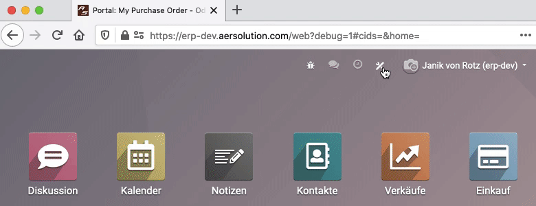
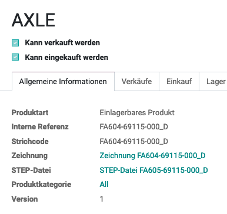

# Studio


## Anpassungen dokumentieren
Aufgabenträger: [Administrator](////////rollen.html.html.html.html.html.html.html.html#administrator)

Jede Änderung mit Odoo Studio an einer Odoo-Instanz muss dokumentiert werden. Die Entwickler von Odoo haben dafür die Menu-Option *Notizen* hinzugefügt.



## Dateianhang in Bericht anzeigen
Aufgabenträger: [Administrator](////////rollen.html.html.html.html.html.html.html.html#administrator)

::: tip
An jedem Odoo-Objekt kann ein Anhang vom Typ Datei oder URL hinzugefügt werden. Dieser Anhang kann im Portal oder Bericht angzeigt werden.
:::

In diesem Beispiel wurde mit Odoo Studio dem Modell *product.product* zwei Felder hinzugefügt:
* Name: x_studio_drawing
	* Typ: Many2One Produktionsdokument
	* Bezeichnung: Zeichnung

* Name: x_studio_step_file
	* Typ: Man2One Produktionsdokument
	* Bezeichnung: STEP-Datei



Diese Felder können im Beschaffungsauftrag angzeigt werden.


Für diese Art von Anpassung muss das XML der Ansicht bearbeit werden, dazu der X-Path-Edit:

```xml
<data>
  <xpath expr="/t/t/div/table/tbody/t[2]/tr/t[1]/td[1]/span" position="after">
    <t t-if="line.product_id.x_studio_drawing">
		<br/>
        <span>Zeichnung: </span>
		<a t-attf-href="{{line.product_id.x_studio_drawing.url}}">
      <span t-field="line.product_id.x_studio_drawing.display_name"/>
    	</a>
    </t>
    <t t-if="line.product_id.x_studio_step_file">
		<br/>
        <span>STEP-Datei: </span>
		<a t-attf-href="{{line.product_id.x_studio_step_file.url}}">
      <span t-field="line.product_id.x_studio_step_file.display_name"/>
    	</a>
    </t>
  </xpath>
</data>
```

## Feld entfernen

Möchten sie ein Feld aus einer Ansicht entfernen, öffnen sie zuerst die Ansicht in Odoo Studion. Anschliessend wählen sie das Feld aus und klicken in der linken Menu-Leiste auf *Aus Ansicht entfernen*

::: warning
Benutzerdefinierte Felder sowie Basisfelder werden nicht aus der Datenbank entfernt. Sie bestehen weiterhin und können der Ansicht wieder hinzugefügt werden.
:::

## Berechtigung auf verstecktem Feld festlegen

Bestimmte Felder und Buttons werden nur im Entwicklermodus also mit den erweiterten Berechtigungen angezeigt. Damit diese Felder und Buttons standardmässig angezeigt werden können, können sie mit Odoo Studion ganz einfach die Berechtigung festlegen.

Dazu ein Beispiel: Ein Arbeitsauftrag ist in Arbeit und bereits Bestände produziert, die man verbuchen kann.


Nur im Entwicklermodus wird die entsprechende Aktion angezeigt:


Damit dieser Button standardmässig angzeigt wird, geht man wie folgt vor:


## Neue Ansichten hinzufügen

Odoo stellt Inhalte in verschiedenen Ansichten dar:
* Listen
* Pivot
* Graphen
* uvw.

Wenn eine Ansicht fehlt, können sie diese mit Odoo Studio ergänzen.

Angenommen der Bericht zum prognostizierten Lagerbestand *Lager > Berichtswesen > Prognostizierter Bestand* soll nebst der grafischen Ansicht eine Pivot-Ansicht erhalten, gehen sie wie folgt vor.

Öffnen sie den Bericht in Odoo Studio. In der Adressleite finden sie diesen Parameter `model=report.stock.quantity`. Das sagt ihnen auf welchen Datenmodell sie mit Odoo Studio arbeiten. Klicken sie auf *Ansichten*, wählen *Privot* und klicken *Ansicht aktivieren*.


Schliessen sie die Bearbeitung mit *Abschliessen* ab. Nun sehen sie unter dem Suchfeld die Ansicht.


## Ansicht als Standard definieren

Beim Aufruf einer App oder eines Menu ruft Odoo die dazugehörige Standardansicht auf. Öffnen sie beispielsweise die App Kontakte, erscheinen die Kontakte in der Listenansicht. Um dies zu ändern öffnen sie die aktive Ansicht im Odoo Studio und wählen *Ansichten*.


Wählen sie die neue Standardansicht an und klicken auf das Menu und auf *Als Standard setzen*. Schliessen sie den Vorgang ab.

## IBAN und Bank auf Rechnung anzeigen

Standardmässig werden die Zahlungsinformationen nur bei konfigurierten ISR- und QR-Code-Einstellungen angzeigt. Falls sie die der Rechnung hinterlegten Kontoinformationen anzeigen möchten können sie das mit Studio einrichten.

Bearbeiten sie den Rechnungsbericht und fügen sie folgenden Code ein:

```xml
<data>
  <xpath expr="/t/t/div/p[2]" position="after">
    <div class="row">
      <div class="col">
        <span>IBAN: </span>
        <span t-field="o.invoice_partner_bank_id.acc_number"/>
      </div>
    </div>
  </xpath>
  <xpath expr="/t/t/div/div[3]" position="after">
    <div class="row">
      <div class="col">
		<span>Bank/BIC: </span>
		<span t-field="o.invoice_partner_bank_id.bank_id.display_name"/>
		<br/>
		<br/>
      </div>
    </div>
  </xpath>
</data>
```

Das Ergebnis sieht so aus:


<hr>

[📝 Edit on GitHub](///////https://github.com/mint-system/odoo-handbuch/blob/master/studio.html.html.html.html.html.html.html)

<footer>Copyright © <a href="https://www.mint-system.ch/">Mint System GmbH</a></footer>

<hr>

[📝 Edit on GitHub](//////https://github.com/mint-system/odoo-handbuch/blob/master/studio.html.html.html.html.html.html)

<footer>Copyright © <a href="https://www.mint-system.ch/">Mint System GmbH</a></footer>

<hr>

[📝 Edit on GitHub](/////https://github.com/mint-system/odoo-handbuch/blob/master/studio.html.html.html.html.html)

<footer>Copyright © <a href="https://www.mint-system.ch/">Mint System GmbH</a></footer>

<hr>

[📝 Edit on GitHub](////https://github.com/mint-system/odoo-handbuch/blob/master/studio.html.html.html.html)

<footer>Copyright © <a href="https://www.mint-system.ch/">Mint System GmbH</a></footer>

<hr>

[📝 Edit on GitHub](///https://github.com/mint-system/odoo-handbuch/blob/master/studio.html.html.html)

<footer>Copyright © <a href="https://www.mint-system.ch/">Mint System GmbH</a></footer>

<hr>

[📝 Edit on GitHub](//https://github.com/mint-system/odoo-handbuch/blob/master/studio.html.html)

<footer>Copyright © <a href="https://www.mint-system.ch/">Mint System GmbH</a></footer>

<hr>

[📝 Edit on GitHub](/https://github.com/mint-system/odoo-handbuch/blob/master/studio.html)

<footer>Copyright © <a href="https://www.mint-system.ch/">Mint System GmbH</a></footer>

<hr>

[📝 Edit on GitHub](https://github.com/Mint-System/Odoo-Handbuch/blob/master/studio.md)

<footer>Copyright © <a href="https://www.mint-system.ch/">Mint System GmbH</a></footer>