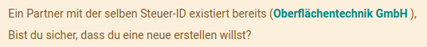

# Theorie Kontakte

Odoo unterscheidet *Einzelperson* und *Unternehmen*. Eine Person kann einem Unternehmen zugeordnet werden. Einem Unternehmen können mehrere Personen zugeordnet werden.

## Felder Kontakt

Eine Übersicht zu den Felder eines Kontakts:

## Anzeigenamen

In einigen Darstellungen erscheinen Einzelpersonen ergänzt mit dem zugeordneten Unternehmen. Dieses (berechnete) Feld nennt sich *Anzeigename*.

Beispiel Ausschnitt *Liste aller Kontakte*:

## Adressart

Die Adressart kann wie folgt eingestellt werden:
- Kontakt
- Rechnungsadresse
- Lieferadresse
- Andere Adresse
- Privatadresse

## Eingabeprüfungen

Das System warnt falls die Gefahr besteht, dass zweimal dieselbe Steuer-ID angelegt wird.

[📝 Edit on GitHub](///////https://github.com/mint-system/odoo-handbuch/blob/master/theorie-kontakte.html.html.html.html.html.html.html)

<footer>Copyright © <a href="https://www.mint-system.ch/">Mint System GmbH</a></footer>

[📝 Edit on GitHub](//////https://github.com/mint-system/odoo-handbuch/blob/master/theorie-kontakte.html.html.html.html.html.html)

<footer>Copyright © <a href="https://www.mint-system.ch/">Mint System GmbH</a></footer>

[📝 Edit on GitHub](/////https://github.com/mint-system/odoo-handbuch/blob/master/theorie-kontakte.html.html.html.html.html)

<footer>Copyright © <a href="https://www.mint-system.ch/">Mint System GmbH</a></footer>

[📝 Edit on GitHub](////https://github.com/mint-system/odoo-handbuch/blob/master/theorie-kontakte.html.html.html.html)

<footer>Copyright © <a href="https://www.mint-system.ch/">Mint System GmbH</a></footer>

[📝 Edit on GitHub](///https://github.com/mint-system/odoo-handbuch/blob/master/theorie-kontakte.html.html.html)

<footer>Copyright © <a href="https://www.mint-system.ch/">Mint System GmbH</a></footer>

[📝 Edit on GitHub](//https://github.com/mint-system/odoo-handbuch/blob/master/theorie-kontakte.html.html)

<footer>Copyright © <a href="https://www.mint-system.ch/">Mint System GmbH</a></footer>

[📝 Edit on GitHub](/https://github.com/mint-system/odoo-handbuch/blob/master/theorie-kontakte.html)

<footer>Copyright © <a href="https://www.mint-system.ch/">Mint System GmbH</a></footer>

[📝 Edit on GitHub](https://github.com/Mint-System/Odoo-Handbuch/blob/master/theorie-kontakte.md)

<footer>Copyright © <a href="https://www.mint-system.ch/">Mint System GmbH</a></footer>